# BlazePlam

[MediaPipe Hands: On-device Real-time Hand Tracking](https://arxiv.org/abs/2006.10214)

## 摘要

我们提出了一种实时设备上手部跟踪解决方案，该解决方案可通过单个 RGB 摄像头为 AR/VR 应用程序预测人类的手部骨骼。我们的管道由两个模型组成：1）手掌检测器(palm detector)，即提供手的边界框，2）手部地标模型(hand landmark model)，即预测手部骨骼。它是通过 MediaPipe实现的，这是一个用于构建跨平台ML解决方案的框架。所提出的模型和管道架构在具有高预测质量的移动 GPU 上展示了实时推理速度。 MediaPipe Hands 在 https://mediapipe.dev 上开源。

## 1. Introduction

**手部跟踪**(Hand Tracking)是为 AR/VR 中的交互(interaction)和通信(communication)提供自然方式的重要组成部分，并且一直是业界的一个活跃研究课题 。基于视觉的手部姿势估计已经研究了很多年。以前的大部分工作都需要专门的硬件，例如深度传感器(depth sensor)。其他解决方案不够轻量级，无法在商用移动设备上实时运行，因此仅限于配备强大处理器的平台。在本文中，我们提出了一种不需要任何额外硬件并在移动设备上实时执行的新颖解决方案。我们的主要贡献是：

- 一个高效的两阶段手部跟踪管道(hand tracking pipeline)，可以在移动设备上实时跟踪多只手。

- 一种手部姿势估计模型(hand pose estimation)，能够仅使用 RGB 输入预测 2.5D 手部姿势。

- 开源手部跟踪管道作为各种平台上的现成解决方案，包括 Android、iOS、Web (Tensorflow.js) 和台式机。

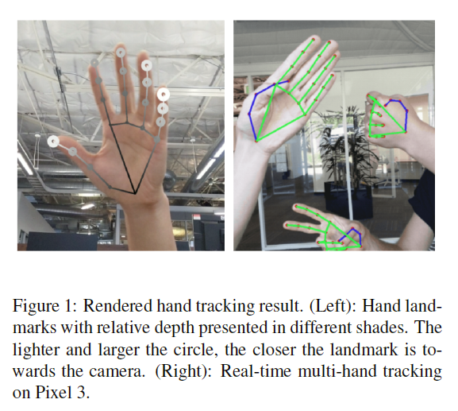

## 2. Architecture

我们的手部跟踪解决方案利用了由两个协同工作的模型组成的 ML 管道：

- **手掌检测器**(palm detector)对完整的输入图像进行操作，并通过定向的手部边界框(oriented hand bounding box)定位手掌。

- **手部地标模型**(hand landmark model)，对手掌检测器提供的裁剪后的手部边界框(hand bounding box)进行操作，并返回高保真 2.5D 地标。

为手部地标模型(hand landmark model)提供精确裁剪的手掌图像大大减少了对数据增强(data augmentation)（例如旋转、平移和缩放）的需求，并允许网络将其大部分容量用于地标定位精度。在实时跟踪场景中，我们从前一帧的界标预测中导出边界框(bounding box)作为当前帧的输入，从而避免在每一帧上应用检测器。相反，检测器仅在第一帧或当手部预测表明手部丢失时启动。

### 2.1. BlazePalm Detector

为了检测初始手部位置，我们采用了针对移动实时应用程序优化的**单次检测器模型**(singleshot detector model )，类似于 BlazeFace，它也可在 MediaPipe 中使用。检测手部绝对是一项复杂的任务：我们的模型必须在大尺度跨度(large scale span)（20 倍）下处理各种手部尺寸，并且能够检测被遮挡和自遮挡的手。尽管面部具有高对比度(high contrast)图案，例如，在眼睛和嘴巴区域周围，但由于手部缺乏此类特征，因此仅从视觉特征中可靠地检测它们相对困难。

我们的解决方案使用不同的策略解决了上述挑战。

首先，我们训练**手掌检测器**(palm detector)而不是手部检测器，因为估计手掌和拳头等刚性物体的边界框比检测带有关节的手指的手要简单得多。此外，由于手掌是较小的对象，**非极大值抑制算法**(NMS, non-maximum suppression algorithm)即使在双手自遮挡情况下也能很好地工作，例如握手。此外，手掌可以仅使用方形边界框(square bounding boxes)进行建模，忽略其他纵横比(aspect ratioss)，因此将锚点的数量减少了 3~5 倍。

其次，我们使用类似于 **FPN**的编码器-解码器特征提取器(encoder-decoder feature extractor)，即使对于小物体也能获得更大的场景上下文感知。

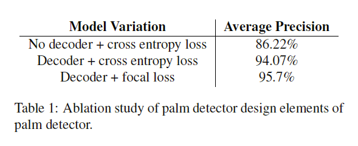

最后，我们在训练期间**最小化焦点损失**(minimize the focal loss)以支持由高尺度方差(high scale variance)导致的大量锚点。高级手掌检测器架构如图 2 所示。我们在表 1 中展示了我们的设计元素的消融研究(ablation study)。

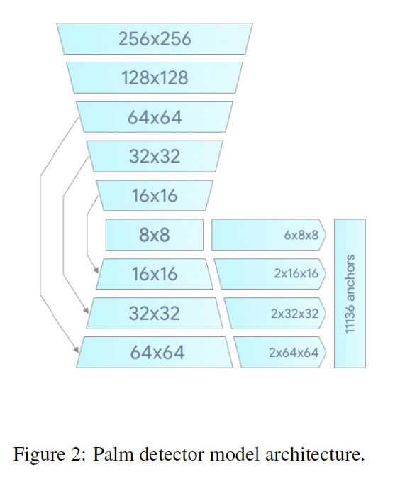

### 2.2. Hand Landmark Model

在整个图像上运行手掌检测(palm detection)后，我们随后的手部地标模型(hand landmark model)通过**回归**对检测到的手部区域内的 21 个 2.5D 坐标执行精确的地标定位。该模型学习一致的内部手部姿势表示(internal hand pose representation)，并且即使对部分可见的手部和自遮挡也具有鲁棒性。该模型具有三个输出（见图 3）：

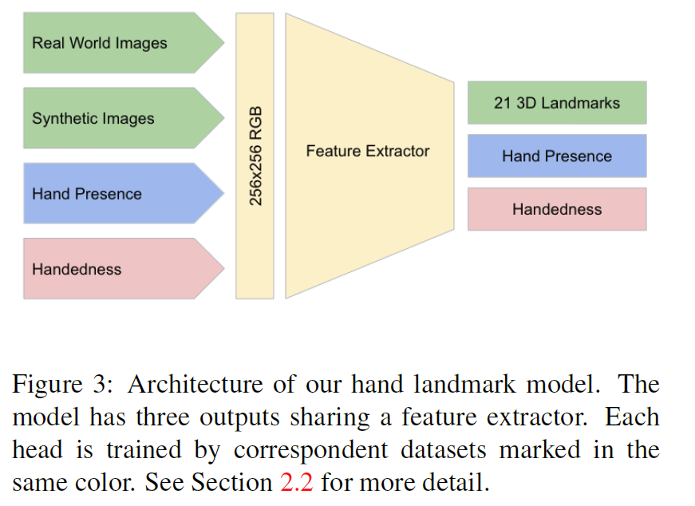

- 由 `x`、`y `和相对深度组成(relative depth)的 21 个手部地标。

- 指示输入图像中手存在概率的手标志(hand presence)。

- 惯用手的二元分类(binary classification of handedness)，例如左手或右手。

**topology**

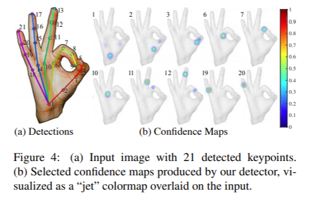

我们对 21 个地标使用与 [14] 相同的拓扑。 2D 坐标是从真实世界的图像(real-world images)以及合成数据集(synthetic datasets)学习的，如下所述，相对深度` w.r.t.`手腕点仅从合成图像中学习。为了从跟踪失败(tracking failure)中恢复，我们开发了类似于 [8] 的模型的另一个输出，用于产生在所提供的裁剪图像中确实存在合理对齐的手(aligned hand)的事件的**概率**。如果分数低于阈值(threshold)，则触发检测器以重置跟踪。**惯用手**(Handedness)是在 AR/VR 中使用手进行有效交互的另一个重要属性。这对于每只手都与独特功能相关联的某些应用程序特别有用。因此，我们开发了一个**二元分类头**(binary
classification head)来预测输入的手是左手还是右手。我们的设置针对实时移动 GPU 推理，但我们也设计了更轻和更重的模型版本，以分别解决缺乏适当 GPU 支持的移动设备上的 CPU 推理和在桌面上运行的更高准确度要求。

## **3. Dataset and Annotation**

为了获得地面实况数据(ground truth data)，我们创建了以下数据集来解决问题的不同方面：

- `In-the-wild` 数据集(In-the-wild dataset)：该数据集包含 6K 个种类繁多的图像，例如地理多样性，各种照明条件和手部外观。该数据集的局限性在于它不包含复杂的手部关节。
- 内部收集的手势数据集(In-house collected gesture dataset)：该数据集包含 10K 图像，涵盖所有物理上可能的手势的各个角度。该数据集的局限性在于它仅从 30 人中收集，背景变化有限。`In-the-wild`数据集和内部数据集是相互补充以提高鲁棒性的。
- 合成数据集(Synthetic dataset)：为了更好地覆盖可能的手部姿势并提供额外的**深度监督**(depth supervision)，我们在各种背景下渲染了高质量的合成手部模型并将其映射到相应的 3D 坐标。我们使用商业 3D 手部模型，该模型由 24 个骨骼构成，包括 36 个混合形状，用于控制手指和手掌厚度。该模型还提供了 5 种不同肤色的纹理。我们创建了手姿势之间转换的视频序列，并从视频中采样了 100K 图像。我们使用随机的高动态范围照明环境和三个不同的相机渲染每个姿势。有关示例，请参见图 4。

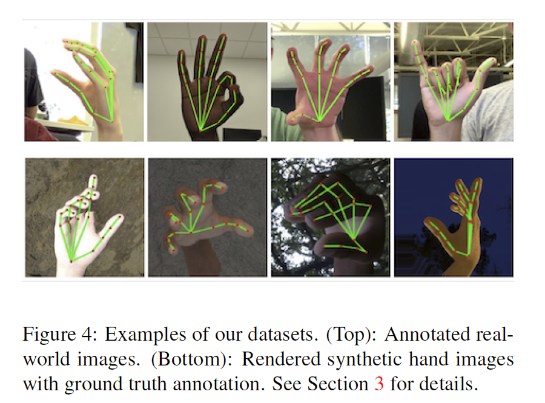

对于手掌检测器(**palm detector**)，我们只使用`in-the-wild`数据集，这足以定位手并提供最高多样性的外观。但是，所有数据集都用于训练手部地标模型(**hand landmark model**)。我们用 21 个地标标注真实世界的图像，并使用投影的真实 3D 关节来合成图像。对于手部存在(**hand presence**)，我们选择真实世界图像的子集作为正例，并在不包括带标注的手部区域的区域上采样作为负例。对于惯用手(**handedness**)，我们使用惯用手标注现实世界图像的子集以提供此类数据。

## 4. Results

对于手部地标模型，我们的实验表明真实世界和合成数据集的结合提供了最好的结果。详见表 2。我们评估仅适用于真实世界的图像。除了品质提升，使用大型合成数据集进行训练会导致更少跨帧视觉抖动(jitter visually across frames)。这一观察使我们相信我们的真实世界数据集可以放大得更好概化(generalization)。

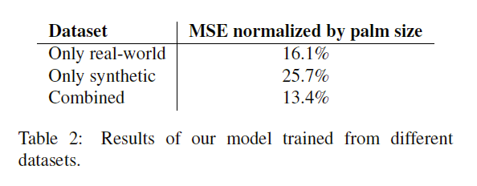

我们的目标是在移动设备上实现实时性能设备。我们尝试了不同的模型大小和发现“完整(Full)”模型（见表 3）在质量和速度之间提供了良好的权衡。增加模型容量进一步只引入了质量上的微小改进,但速度显着下降（详见表 3）。 我们在设备上使用 TensorFlow Lite GPU 后端推论[6]。

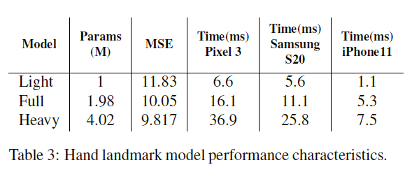

## 5. Implementation in MediaPipe

使用 MediaPipe，我们的手部跟踪管道(hand tracking pipeline)可以构建为模块化组件的有向图(a directed graph of modular components)，称为**计算器**(Calculators)。 Mediapipe 带有一组可扩展的计算器，用于解决跨各种设备和平台的模型推理、媒体处理和数据转换等任务。裁剪、渲染和神经网络计算等单个计算器进一步优化以利用 GPU 加速。例如，我们在大多数现代手机上使用 TFLite GPU 推理。

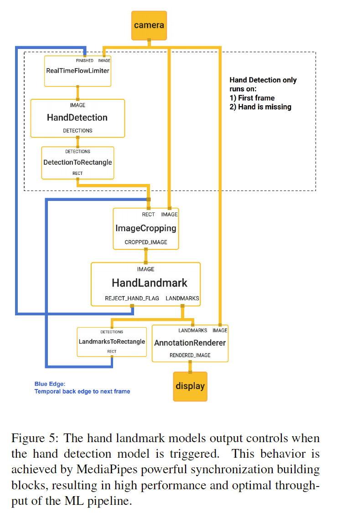

我们用于手部跟踪的 MediaPipe 图如图 5 所示。该图由两个子图组成，一个用于手部检测，另一个用于地标计算。 MediaPipe 提供的一项关键优化是手掌检测器仅在需要时运行（相当少），从而节省了大量计算。我们通过从前一帧中计算出的手部标志推导出当前视频帧中的手部位置来实现这一点，无需在每一帧上应用手掌检测器。为了鲁棒性，手部跟踪器模型还输出一个额外的标量，以捕捉手部存在并在输入裁剪中合理对齐的置信度。只有当置信度低于某个阈值时，手部检测模型才会重新应用于下一帧。

## 6. Application examples

我们的手部跟踪解决方案可轻松用于多种应用，例如手势识别和 AR 效果。在预测的手部骨骼之上，我们使用一个简单的算法来**计算手势**(compute gestures)，见图 6。

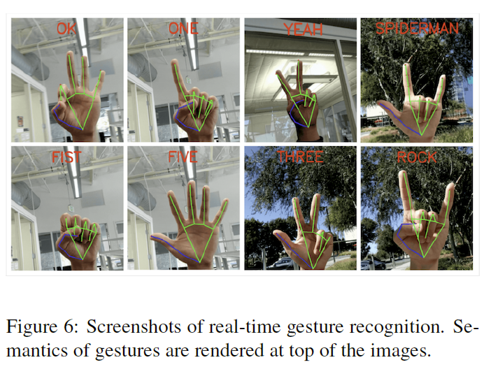

首先，每个手指的状态，例如是弯曲的还是直的，是通过关节的累积角度(accumulated angles)来确定的。然后，我们将一组手指状态映射到一组预定义的手势。这种简单而有效的技术使我们能够以合理的质量估计基本的静态手势(static gestures)。除了静态手势识别之外，还可以使用一系列地标来预测动态手势。另一个应用是在骨架顶部应用 AR 效果。基于手的 AR 效果目前很受欢迎。在图 7 中，我们展示了霓虹灯风格的手部骨骼的 AR 渲染示例。

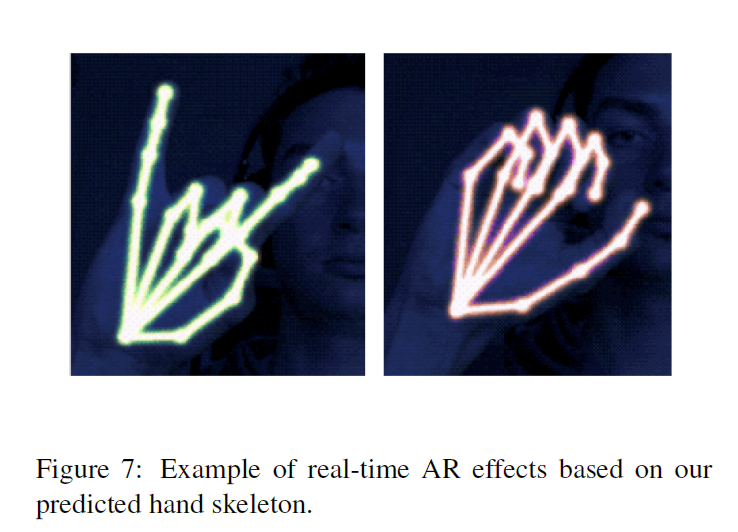

## 7. Conclusion

在本文中，我们提出了 MediaPipe Hands，这是一种端到端的手部跟踪解决方案，可在多个平台上实现实时性能。我们的管道无需任何专用硬件即可预测 2.5D 地标，因此可以轻松部署到商品设备上。我们开源了管道，以鼓励研究人员和工程师使用我们的管道构建手势控制和创意 AR/VR 应用程序。

# 总结

在各类技术领域和平台中，感知手部形状与运动轨迹的能力都是非常重要的，这有助于提高用户体验。这个能力既可以用来作为手语理解和手势控制的基础，也可以结合增强现实技术方便地在现实世界之上叠加数字内容与信息。虽然人类生来便拥有稳健的实时手部感知，但在计算机视觉领域，此任务却颇具挑战性，这是因为手经常会遮住自己或另一只手（例如手指 / 手掌间的遮挡以及握手），并且缺乏高对比度模式供计算机识别。

今天，我们推出了一种全新的手部感知方法，该方法基于 MediaPipe 框架而实现，这种开源的跨平台框架可用于构建流水线，进而处理不同模式（如视频和音频）的感知数据。

此方法利用**机器学习 (ML) 推断出单帧内的 21 个 3D 手部关键点，从而提供手部与手指的高保真追踪轨迹**。目前，最先进的方法主要依靠功能强大的桌面环境实现推理，而我们的方法却可在手机端实现实时性能，甚至是扩展到感知多个手部。我们希望将这种手部感知功能推向更多研究和开发社区，以便涌现出更多富有创意的用例，并推动产生新应用和新研究途径。

### **用于手部追踪和手势识别的机器学习流水线**

我们的手部追踪解决方案采用 **ML 流水线**，该流水线包含下列共同工作的模型： 

- **手掌检测模型(Palm detector)**（称为 “BlazePalm”），用于对整个图像进行操作并返回定向的手部边界框。 
- **手部关键部位模型(Hand Landmarks)**，用于对手掌检测模型所定义的裁剪图像区域进行操作，并返回高保真度的 3D 手部关键点。 
- **手势识别器(Gesture Recognizer)**，用于将先前计算出的关键点结构分类为一组离散手势。

此架构类似于我们近期公布的面部网格 ML 流水线所用架构，以及其他用于姿势估测的架构。通过为手部关键部位模型提供精确裁剪的手掌图像，我们可以大幅降低对数据增强（例如旋转、平移和缩放）的需求，让网络将其大部分容量用于提升坐标预测精度。 

### **BlazePalm：实时手部 / 手掌检测** 

为检测初始手部位置，我们采用一种称为 BlazePalm 的**单发检测模型**，并针对移动端的实时使用情况对其进行了优化，优化方式与 BlazeFace（同样可在 MediaPipe 中 获取）类似。手部检测是一项颇为复杂的任务：我们的模型必须适应各种手部尺寸，因此相对于图像帧，它拥有更大的检测范围（约为其 20 倍），并能检测出被遮挡和自遮挡的手部。人脸具有高对比度（例如眼睛和嘴巴区域），但手部缺少这样的特征，因此我们很难仅凭视觉特征实现可靠的手部检测。相反，提供手臂、身体或人体特征等额外背景有助于提升手部定位的精度。 

我们的解决方案使用不同策略来攻克上述挑战。首先，我们并未训练手部检测器，而是**训练手掌检测器**，原因是相较于检测具有关节和手指的手部，估算手掌和拳头等固定对象的边界框要简单得多。此外，由于手掌的尺寸较小，即使在双手自遮挡的情况（如握手）下，**非极大值抑制算法**亦能表现出色。同时，我们使用方形边界框（即 ML 术语中的锚点）来模拟手掌，并忽略其他高宽比，从而将锚点数降低 300% 至 500%。其次，即使是针对小尺寸对象，我们仍然利用**编码 - 解码特征提取器**来感知更大场景的背景（与 RetinaNet 方法类似）。最后，我们将训练过程中的 焦点损失降至最低，从而支持因高缩放方差而产生的大量锚点。 

利用上述技术，我们在手掌检测中取得 95.7% 的平均精度。如果使用常规的交叉熵损失且不使用解码器，则得出的基线仅为 86.22%。 

### **手部关键部位模型**

在对整个图像进行手掌检测后，我们随后使用手部关键点模型，在检测到的手部区域内通过回归对 21 个 3D 手关节坐标执行精确的关键点定位，即**直接预测坐标**。该模型学习一致的内部手势表征，即使对部分可见和自遮挡的手部，也能表现出稳健性。 

为获取实况数据，我们手动标注了约 3 万张包含 21 个 3D 坐标的真实图像，如下图所示（如果存在对应的坐标，则从图像深度图中提取 Z 值）。为涵盖更多可能出现的手势并对手部几何性质提供更多监督，我们还在各种背景下渲染出手部的优质合成模型，并将其映射为相应的 **3D 坐标**。 

然而，纯合成的数据很难适用于自然场景。为解决此问题，我们采用了**混合训练架构**。下图展示高级模型训练图。 

下表根据训练数据的性质对回归精度进行了总结。若混用合成数据和真实数据，则可以显著提升性能。 

### **手势识别** 

预测出手部骨架后，我们使用一种简单算法来推导手势。**首先，关节的弯曲角度决定每根手指的状态（弯曲或伸直）。随后，我们将这组手指状态映射为一组预定义的手势。利用这种直接而有效的方法，我们可以估算出基本的静态手势，同时保证检测质量。**现有流水线支持计算多种文化背景（如美国、欧洲和中国）下的手势，以及各种手势标志，包括 “非常棒”、握拳、“好的”、“摇滚” 和 “蜘蛛侠”。 

### **通过 MediaPipe 完成实现** 

借助 MediaPipe，我们可以将这种感知流水线构建为模块化组件的有向图，而这些模块化组件也称为 “计算单元”(Calculator)。MediaPipe 附带一组可扩展的计算单元，可用于解决各种设备和平台上的模型推理、媒体处理算法和数据转换等任务。而诸如裁剪、渲染和神经网络计算等单个计算单元可基于 GPU 独立运行。例如，我们在大多数现代手机上使用 TFLite GPU 推理。 

用于手部追踪的 MediaPipe 架构如下图所示。该图包含两个子图：一个用于手部检测，另一个用于手部关键点（即关键部位）计算。MediaPipe 提供一项重要优化，即手掌检测器仅在必要时（极少数情况）才运行，从而大幅减少计算时间。我们通过从当前帧中计算得出的手部关键点，推断后续视频帧中的手部位置，从而实现优化，无需在每帧上运行手掌检测器。为获得稳健性，手部追踪器模型会额外输出一个标量，用于捕获手存在且与输入裁剪图相应对齐的置信度。只有当置信度低于特定阈值时，手部检测模型才会重新应用于整个帧。

高效的 ML 解决方案可跨不同平台和设备实时运行，并且其复杂度远胜于上方的概述图。为此，我们将对 MediaPipe 框架中的上述手部追踪和手势识别流水线进行开源，并附带相关的端到端 使用场景和源代码。如此一来，研究人员和开发者便可拥有完整的资料，并基于我们的模型对各种新奇想法进行实验和原型设计。

### **未来研究方向** 

我们计划使用更稳健的追踪扩展此项技术，扩大能可靠检测出的手势数量，并支持动态手势的及时展开。我们相信，发布这项技术能够推动广大研究人员和开发者社区成员提出新的创意和应用。期待见证您的成果！ 

