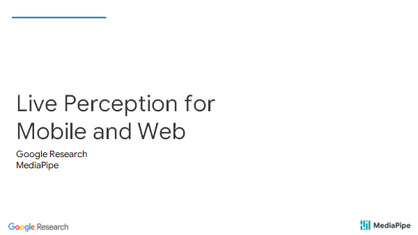
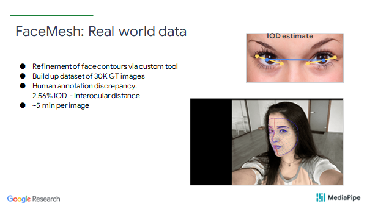
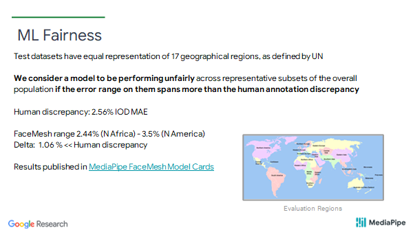

Live Perception for Mobile and Web

1. 

Live Perception 实时感知

live perception for mobile and web ------  移动和网络的实时感知

**什么是实时感知？**

2.

Viewfinder ML -----  取景器ML

**Live Perception = ML on-device + in real-time + with low-latency**

**实时感知 = 设备上的机器学习 + 实时 + 低延迟**

Applications : virtual try-on ---- 虚拟试穿     AR Effects  ---- 现实效果增强

​					Smart framing --- 智能取景   Device control --- 设备控制

​						Smart cameras & mirrors --- 智能相机和镜子

Benefits: Device-local  --- 本地设备	connection-free --- 免连接

​				Privacy-conscious  --- 注重隐私   

​				Immediate  ---- 即时

​                Create-in-viewfinder ----- 在取景器中创建

​				Enables actions/control 启动动作/控制

- 基本上任何类型的机器学习都发生在设备上的取景器中，具有实时和低延迟的特性。
- 应用也非常广泛。比如，虚拟化妆、现实效果增强，智能取景、智能控制设备等。
- 实时感知的好处：因为所有的计算发生在设备上，没有连接到互联网，也不用向服务器发送任何数据，所以具有内在的隐私特性。同时结果在取景器中是即时的，它可以像在 youtube 或 tiktok 中看到的那样在取景器中直接创建的相关用例。

3. 

**实时感知的技术挑战**

- **模型约束：**ML 推理 < 20 毫秒

  - 低容量网络 => 特定领域

  - 遵循5个核心原则

- **关键的跨平台基础设施**

  - **MeidiaPipe:**ML解决方案 --- 管道 + GPU支持 + 同步
  - **XNNPack:**移动/网络上的 CPU 加速推理
  - **GPU delegate TF-Lite:**移动上的GPU加速

- **同步：**延迟取景器(~100-200ms)

- 模型约束 ---- 任何类型的ML推理都需要在 20 毫秒或更短的时间内完成，因为你通常想运行额外的处理步骤，比如渲染，这意味着你被限制在低容量网络。像提取大型服务器模型(distilling a large server model )这样的经典方法往往会导致较差的结果，因此您需要在设计模型时考虑到实时感知。我们发现在该领域非常成功的五个核心配方。 

  CML 模型 --- Collaborative Metric Learning 协作度量

- 跨平台 ----- 实时感知需要前沿(cutting-edge)的机器学习推理，比如XNNPack, GPU加速的TFLite。除了推理还有很多难题。 MediaPipe 使处理这些问题变得简单。它是 ML 解决方案的跨平台框架，结合了多模型推理 GPU 加速以及同步机制，最后封装成一个易于使用的包(package)。
- 同步 ---- 关于同步问题，有一个源于 ML 推理的固有延迟(inherent latency)以及相机管道(camera pipeline), 它加起来大约是 100 到 200 毫秒，就像你在右边看到的那样，MediaPipe 使开发人员和研究人员可以轻松处理这个问题。
- 右图：使用 3 部手机测量的现实图像到取景器的延迟

4. 

- 用于实时感知的经过验证的ML解决方案
  - 面部网格和虹膜跟踪
  - 手部骨架和手势识别
  - 人体姿势
  - 任意对象的2D跟踪
  - 3D物体检测

- 实施感知基础设施
  - MediaPipe
  - CPU和GPU加速的ML推理

5. 

6. 

- **ML Pipelines**  --- 机器学习管道

ML pipeliines with coupled, task-specific models vs. monolithic model 

具有耦合的特定任务模型的 ML 管道与整体模型

- **Reduce Augmentations**  --- 减少增强

Coupled models => limited input domain => reduce augmentations => more capacity for accurate predictions

耦合模型 => 有限的输入域 => 减少增强 => 更准确预测的能力

- **Reduce outputs**   --- 减少输出

reduce output layers: Regression over Heatmaps 

减少输出层：在热图上使用回归

- **Reduce Label noise**   --- 减少标签噪音

Use high-quality consistent annotations => 30-50K GT samples are sufficient

使用高质量一致的标签 => 30-50K GT 样本就足够了

- **Synthetic Data for 3D**  ----  3D 合成数据

unlock 3D via synthetic data and multi-task training

通过合成数据和多任务训练解锁 3D

- 研究发现有五个核心原则对ML solutions是很有用。第一，构建 ML 管道或小型任务特定模型与一个大的整体模型。通过将这些小模型紧密耦合在一起，可以减少它们之间的增强，从而提升准确预测的能力。面对移动设备上的有限容量的问题，可以减少输出层，因此使用了热图回归的方法。通过使用质量非常高的数据集一致的标签，可以使数据集大小降到 30000 到 50 000 个样本。通过大量使用合成数据来解锁 3d 预测，而无需使用任何形式的扫描设备。

7. 

让我们从我们的第一个 ML 解决方案面部检测开始。

8. 

MediaPipe FaceMesh  ---- 面部网格

- 应用： Youtube Stories, AR-Ads, Duo Effects, MLKit Face Contour(轮廓), ARCore

- 难题：
  - 无需使用专用深度传感器即可预测人脸几何形状
  - 热图方法不能扩展 480+ 关键点
  - AR化妆需要高精度对齐(拟合) --- 唇部和眼部跟踪
- 通过 TFLite GPU + XNNPack 加速
- 可用于 MediaPipe，TF.js，ML Kit，ARCore 中的开发人员

9. 

应用：推动虚拟化妆和广告中的自我表达效果谷歌Duo和 YouTube 故事中的自拍效果

10. 

**工作原理：**

- 2个ML模型：

  MeidaPipe pipeline: **BlazeFace Detector** + **3D FaceMesh network**

  - **BlazeFace** --- 返回定向的ROI
  - **3D Mesh network**   ---- 根据ROI预测面部网格

- **FaceMesh** 模型可重复使用上一个 前一个ROI框架

- **BlazeFace** 模型仅在第 1 帧或面部网格丢失时运行

FaceMesh是由两个ML模型组成的 Mediapipe 管道。第一个是定位人脸的BlazeFace Detector。从图像中返回一个定向的感兴趣区域(ROI)，然后是对这个感兴趣区域(ROI)进行分析并预测 486 个地标的 3d FaceMesh network。好处在于，不必在每一帧上运行人脸检测器，而只在第一帧上运行，或者存在跟踪错误时，否则人脸网格可以重复使用前一帧的ROI。

11. 

BlazeFace: 亚毫秒人脸检测器

- 预测人脸矩形 +6 个地标
- 针对自拍用途/移动用例进行了优化
- 利用 TFlite GPU、XNNPack for TFlite 和 tf.js
- 支持所有 FaceMesh 应用程序

12. 

开发者支持

13. 

FaceMesh --- 设计元素

- 从 ROI 裁剪+旋转人脸检测中预测 486 个 3D 地标
- 在热图上使用回归
- 紧密的探测器耦合：
  - 限制裁剪增强
  - 预测 ROI 中的人脸存在 -> 触发检测
- 在3个数据集上训练：2D 轮廓 + 真实世界网格 + 合成网格

图：

3D point coordinates  --- 3D点坐标

2D semantic coutours  -- 2D 语义模型(轮廓)

face presence flag  --- 面部存在标志

14. 

FaceMesh: Annotation challenge  标注挑战

- 从头开始注释高保真地标很难！
- 引导方法:
  - 从 2D 轮廓 + 合成数据训练初始模型
  - 使用循环中的人类优化引导注释

图：

synthetic rendered   ---  合成渲染

augmented data ----- 增强数据

initial  model --- 初始模型

anotated data ------ 标注数据

Best current Model    

human annotation refinement + augmentation  --- 人工标注细化+增强

raw face images + bootstrapped annotations ---- 原始人脸图像 + 自举标注

15. 

FaceMesh: Synthetic data  合成数据

- 10K 合成Baselimages渲染到真实照片上
- 真实情况：通过映射网格的 3D 点

- 初始模型：RGB → 3D 点

16. 

FaceMesh: Real world data  真实世界数据

- 通过自定义工具细化面部轮廓
- 建立 30K GT 图像的数据集

- 人类注释差异：2.56% IOD - 眼间距离

- 每张图片约 5 分钟

17. 

FaceMesh: Performance 性能

- 两种型号：Full 和 lite
- 准确率与人类相似（2.56%）
  - 跨地区的 IOD 为 2.44% - 3.5%

纵坐标 --- 延迟时间

18. 

ML Fairness  --- 机器学习公平性

测试数据集具有联合国定义的 17 个地理区域的同等代表性

如果模型的误差范围超过人类注释差异，我们认为模型在总体人口的代表性子集上表现不公平

人类差异：2.56% IOD MAE

FaceMesh 范围 2.44%（北非） - 3.5%（北美洲）
Delta：1.06 % << 人类差异

19. 

Face Mesh: AR Makeup   增强现实化妆

- 通过图像过滤模拟逼真的化妆

- 从 FaceMesh 获取准确的唇部区域
  - 将光谱分成几个范围
  - 单独过滤每个范围
  - 应用虚拟化妆材料
  - 与原始图像合并和融合
- 3 个范围：中间色调、阴影、高光
- 高度逼真：46% 的 AR 图像被用户研究认为是真实的

20. 

MediaPipe Iris  --- 虹膜

- 使用每只眼睛 5 个地标扩展 FaceMesh
- 使用约 50K 图像的真实世界数据集

eye landmarks 3d   ----- 眼睛地标 3d

Iris landmarks 2D ---- 虹膜地标 2d

21. 

MediaPipe Iris : Single Image Depth    单幅图像深度

- 物理虹膜直径大致恒定在 11.7±0.5 毫米

- 假设已知焦点（EXIF、Android/iOS API）可以确定平均深度内的度量深度。 5%的误差

使用 Mediapipe Iris，我们能够估计单个图像度量，在这里我们利用人类虹膜直径大致恒定为 11.7 毫米的事实，因此如果您有一个已知的公制焦距，例如，您可以从多余的部分中获得数据或任何我们能够证明的捕获 api，我们可以在大约 5% 的误差范围内确定公制深度，当您将标尺标记与移动应用程序上确定的深度进行比较时，您可以在右侧看到

22. 

Puppets in Duo ---- Duo中的木偶

- 使用 FaceMesh 和 Iris 模型

- 通过启发式和深度网络的组合提供连续语义 [0,1]

- 在 Android / iOS 上驱动 Duo Puppets

23. 

**Hand skeletons and gestures**  ---- 手骨架和手势

24. 

- **独特困难的 ML 问题：**

  - 广泛的手型尺寸：20x-40x

  - 高度咬合（自咬合，例如手指和多只手）
  - 无数的姿势和手势
  - 缺乏高对比度（与面孔或人物相比）

- 用例

  手势、徒手“鼠标”/“机械手”、AR 试戴（戒指、手表）、手语

25. 

- 两种机器学习模型：

  **MediaPipe** pipeline: **Palm Detector** + **Hand Landmarks** 

  - 手掌检测器返回定向的ROI
  - Landmark 模型从 ROI 作物中预测关键点

- 重新使用上一个 ROI 的地标模型框架

- 手掌检测器仅在第 1 帧或当地标指示手部未命中时运行

26. 

关键观察：手掌而不是手检测

- 手掌僵硬（没有铰接的手指）

- 手掌很小：NMS 效果更好，因为遮挡较少

- 大致方形纵横比 -> 锚减少

- 输入：RGB 帧
- 输出：SSD 风格的锚点 + 每手掌 7 个地标

- 50K 训练图像

27. 

Design Elements: 

- 添加了带跳过连接的解码器：

​      小物体的特征金字塔网络方法

- 要解决的焦点损失 (RetinaNet)
  fg/bg 不平衡（由于小手掌）

我们采用了最近文献中的构建块，第一个是特征金字塔方法，因此我们不仅以最小的分辨率预测具有最高语义信息的锚点，还再次采样，然后在每个分辨率下进行预测，这有助于我们定位较小的手，然后手相对于背景而言往往相当稀疏，因此我们使用 ReginaNet 的焦点损失来解决这种前景背景不平衡问题。如果您将这两种方法结合起来，您会看到在我们的对比研究中，您会得到平均精度的显着改善或提升。

28. 

Hand Landmarks: Design Elements 

- 从 ROI 裁剪+旋转手掌检测中预测 21 个 3D 地标

- 在 2 个数据集上训练：真实世界数据 + 合成数据

- 预测 ROI 作物中的手部存在 -> 触发检测

separable convolutional feacture extractor ------- 可分离卷积特征提取器

29. 

手数据来源：GT注解

- 21 个手动关键点标注在 100K 图像上
- 人类表现：4% 标准偏差 w.r.t.手掌高度

30. 

手势数据来源：合成数据

- 100K 渲染，120 多个手势

- 在带有 HDRi 照明的搅拌机中渲染

- 映射到相同的 21 个关键点

31. 

- 使用合成器 + 真实世界提供了可观的质量提升

- 合成数据解锁 3D 预测
  - 仅在 3D 上训练 z 坐标
  - 屏蔽真实世界数据的梯度

mean regression error normalized by palm ----- 手掌归一化的平均回归误差

32. 

- 源自 Hand Landmarks（启发式或 ML 模型）
- 优势：扩展到数百个手势

- 每个手势没有单独的网络

33. 

人体姿势

34. 

MediaPipe BlazePose

- 目标：以实时速度超越 SOTA 质量

- Challenges:
  - 默认 COCO 17 关键点拓扑缺乏关键的手脚位置
  - 现有模型对用例不准确：手语、健身/瑜伽、舞蹈

- 特性：
  - 实时、移动优先、网络友好
  - 专注于跟踪少数人，准确，有限规模（最大6m）

35. 

BlazePose 拓扑

**新的33个关键点架构**

- 定位手脚（缩放+旋转）
- 超集：
  - Coco Pose
  - BlazeFace
  - BlazePalm

36. 

- **MediaPipe** pipeline:

  Extended **BlazeFace Detector** + **Pose Landmarks** 

  - Extended BlazeFace detector:

  通过两个虚拟关键点（ROI 的中心和比例/半径）返回定向人员的 ROI

  - Landmark model predicts from ROI crop
    - 33 个具有可见性的身体关键点
    - 2个用于下一帧裁剪的虚拟地标

37. 

BlazePose: Landmarks

独特的架构：

- 具有热图监督的回归网络

- 网络流：A -> B -> C
- 训练流程：
  - 使用热图训练 A + B（来自 GT 注释）
  - 切割热图头部图像
  - 训练 C（A, B 常数）用于回归头部头像

图：

heat maps + offset maps  ---- 热图+偏移图

input RGB Image

stop gradient connection   ----- 停止梯度连接

地标模型背后的一个有趣的设计原则是，它不仅仅是一个回归网络，而且是一个带有热图监督的回归，所以我们实际上做的是首先用我们从地面证明注释派生的热图训练 a 列和 b 列，然后我们移除热图头部，然后我们只预测产生 33 个关键点的塔 c 和可见性，当您查看性能时，您会看到该位置在具有挑战性的数据集上构成，例如瑜伽表演类似于最先进的公开帖子，但是明显更快。

38. 

应用：

- 支持新的 MLKit Pose API

- 移动 CPU/GPU 上的实时性能

39. 

2D 追踪：Powering Lens，谷歌翻译

40. 

MediaPipe BoxTracking

- 通用跟踪：跟踪任何目标

- 2个阶段过程：
  视频 --- 运动分析 ---- 追踪元数据 -- 边界框跟踪

1. 来自稀疏光流的运动分析，fg/bg 分类 => 跟踪元数据

2. 跟踪元数据与外观 => 以最小的延迟增加跟踪多个对象

41. 

BoxTracking - 发布

42. 

MediaPipe BoxTracking

- 实时设备上跟踪和对象检测

- MediaPipe 中的开发人员可用

43. 

**3D Object detection**

44. 

超越 2D 对象检测：

- 移动设备上的 3D 边界框检测和跟踪
- 类别级别识别（例如鞋子、家具）与实例/模板（特定产品）

- 9DOF 任务：检测 6 DOF 姿势（旋转 + 平移）和 3 DOF 维度

45. 

Objectron：数据收集

挑战：如何以度量方式注释世界？

观察：AR Sessions 是自动驾驶场景的稀疏形式

ARSession：ARCore/ARKit 捕捉 3D 点云、平面几何和相机姿势

数据：在 9 个国家/地区收集的 16k 视频/500 万张图片

46. 

Objectron：数据标注

- 使用 ARSession 数据跟踪世界和丰富的 3D 几何数据录制视频

- 高效：在 3D 中注释单帧 => 视频中每一帧的长方体
- 注释优势：每段视频 7 分钟 => 每帧 1.5 秒！！

47. 

Objectron：多任务网络

- 单阶段无锚 3D 对象检测

- 多头：质心热图、距离场、分割掩码

- 按比例输出 3D 边界框 (EPnP)

48. 

49. 

推理时间：Pixel 3 上的 31 毫秒/帧（通过 TFLite GPU）

50. 

实时感知基础设施

51. 

启用基础设施

- MediaPipe：跨平台机器学习解决方案变得简单

- 加速设备端 ML 推理、
  - XNNPack
  - TF-Lite 中的 GPU 后端

52. 

MediaPipe：跨平台机器学习解决方案变得简单

- 为移动、边缘、云和 Web 构建世界一流的 ML 解决方案和应用程序
- 在谷歌的研究和产品中广泛用于构建机器学习解决方案

**端到端加速**

利用 CPU/GPU 的快速 ML 推理和加速预处理/后处理

**一次构建，随处部署**

统一解决方案适用于 Android、iOS、桌面/服务器、物联网和网络

**即用型解决方案**

先进的机器学习解决方案展示了框架的全部功能

**免费和开源**

Apache 2.0 下的框架和解决方案，完全可扩展和可定制

53. 

MediaPipe：端到端加速

- 与移动/物联网上的 TensorFlow Lite 深度集成，以实现全面的硬件加速（CPU、GPU、Edge TPU

- 示例：在三星 S9 上
  - GPU 上的面部网格 2x+ 速度 vs.中央处理器
  - GPU 6x+ 上的头发分割速度 vs.中央处理器

- 具有多上下文支持的 GPU 加速预处理/后处理，实现端到端加速管道

54. 

MediaPipe：一次构建，随处部署

ML 解决方案可轻松编译到 Android、iOS、桌面/服务器、Python、IoT 和 Web 上

55. 

MediaPipe：即用型解决方案

56. 

MediaPipe：免费和开源

- 宽松的 Apache 2.0 许可证
- 构建和分发您自己的 ML 解决方案
- 使用和分发即用型 ML 解决方案

- 自定义即用型 ML 解决方案：插入您自己的模型、修改参数、扩展新功能......

57. 

MediaPipe 示例：手部追踪

58. 

简单的机器学习管道

视频输入，例如来自实时摄像机取景器

几何变换以调整大小和旋转等

将图像转换为张量

对于给定的 ML 模型，运行 ML 推理

将张量解码为高级元数据

将地标渲染到相关图像上

视频输出，例如显示

通常一个简单的机器学习管道由各种构建块组成，正如您在此处看到的，我们从输入视频开始，通常我们会进行某种颜色转换或调整大小和裁剪，然后我们必须将其转换为张量运行实际推理，如果这是一个回归网络，我们得到了地标，然后我们通常希望在我们将视频呈现在显示器上之前用输入图像至少渲染它。

59. 

MediaPipe管道

MediaPipe Graph 表示一个感知管道

管道中的每个节点都是一个 MediaPipe Calculator

两个节点可以通过一个 Stream 连接，它携带带有升序时间戳的数据包序列(Packets)

所有这些都抽象在一个 Mediapipe 管道中，我们称之为MediaPipe Graph。每个我们称之为calculator和calculator的node都与stream连接，其中Packets从一个calculator的输出流到另一个calculator的输入

60. 

Built-in Calculators 内置计算器

图像和media processing的calculators集

与 TensorFlow 和 TF Lite 的本地集成以进行 ML 推理

用于常见 ML 任务（例如检测、分割和分类）的 ML 后处理calculators

用于例如图像注释、流控制的实用calculators

Mediapipe 带有各种用于图像和Media处理的内置Calculators，它还带有calculators，可以利用 tensorflow 和 tensorflow lite 轻松进行推理，然后有各种用于常见机器学习任务的后处理calculators以及实用calculators例如用于注释渲染或流控制。

61. 

同步：

MediaPipe 框架处理的同步以对齐时间序列数据

- 默认情况下，calculator的所有输入都是同步的

- 此处：框架缓冲输入以用于隐藏 ML 延迟的时间对齐渲染

Mediapipe 的一个非常好的一点是它使同步非常简单，默认情况下，calculator的所有输入都是同步的，因此框架确实看到了繁重的工作，例如机器学习结果与输入图像的时间线，因此您可以同步渲染您可以呈现给用户的结果。'

62. 

Hand Pipeline

- 从输入到 ML 推理到渲染的所有 GPU E2E 管道

- 两个模型 BlazePalm 检测器和手部地标跨帧协同工作

这是我们之前一直在查看的 handPipeline 示例，因为您可以看到从输入到输出的所有操作都在 gpu 上端到端完成 ML 推理以及渲染。您可以看到两个模型的Landmarks和Hand Detector跨帧协同工作，结果或细节实际上相当复杂，所以我鼓励您查看我们的可视化链接上的详细信息。

63. 

启用基础设施

64. 

设备端推理：挑战

- 移动 CPU 不如服务器 CPU 强大

  设备端推理 = 向 CPU 添加重要的计算密集型任务

- 有限的内存和内存带宽

  模型尺寸很重要

- 额外开销

  - 能耗增加 = 电池寿命缩短
  - 增加的热分布 = 节流 = 较慢的计算

- 两种解决方案：

  - 通过 XNNPack 加速 CPU
  - 通过 TF-Lite 的 GPU 代理进行 GPU 加速

65. 

XNNPack：优化的 CPU 操作

- 神经网络算子库
  - 为浮点神经网络运算符提供高度优化的实现
  - 运算符针对 ARM NEON / x86-64 进行了优化
  - 关键操作（conv、depthwise conv、deconv、FC）在手机常用ARM内核的组装中进一步调整
  - 运算符融合：检测常见组合（转换 + 填充）并融合为单个加速运算

66. 

XNNPack：加速

- 比以前的 TFLite CPU 实现提供 30-100% 的加速

- 选择加入 TFLite，在未来版本中默认

67. 

TF-Lite 中的 GPU 后端

- GPU：移动设备上无处不在的加速器
  - 与 CPU 相比，计算能力提高了 5 倍以上
  - 大多数 Android 手机支持 ES 3.1+ Compute（20 年 7 月）

68. 

NPU 作为替代？

NPU 格局仍然分散，每设备解决方案

- 仅限于供应商特定的应用程序，例如相机应用

- 仅限于高级设备
- 没有统一的 SDK 可用

69. 

GPU加速：内存布局

- GPU 友好的张量表示：将通道拆分为 4 的倍数

- 示例：[H, W, C] = [8, 6, 12]

70. 

GPU 加速：优化的着色器

优化成分：

1. 减少着色器程序的数量

   将元素操作与更复杂的操作融合在一起，例如CONV_2D

2. 减少内存 I/O

   将小张量内联到着色器程序中

3. 创建着色器程序专业化

   特定于参数的专业化，例如1x1 CONV_2D

   特定于硬件的专业，例如Adreno, Mali

   

71. 

GPU 加速：性能

- OpenGL 加速：比 CPU 快 2 倍

- OpenCL 加速：比 CPU 快 4 倍

72. 

