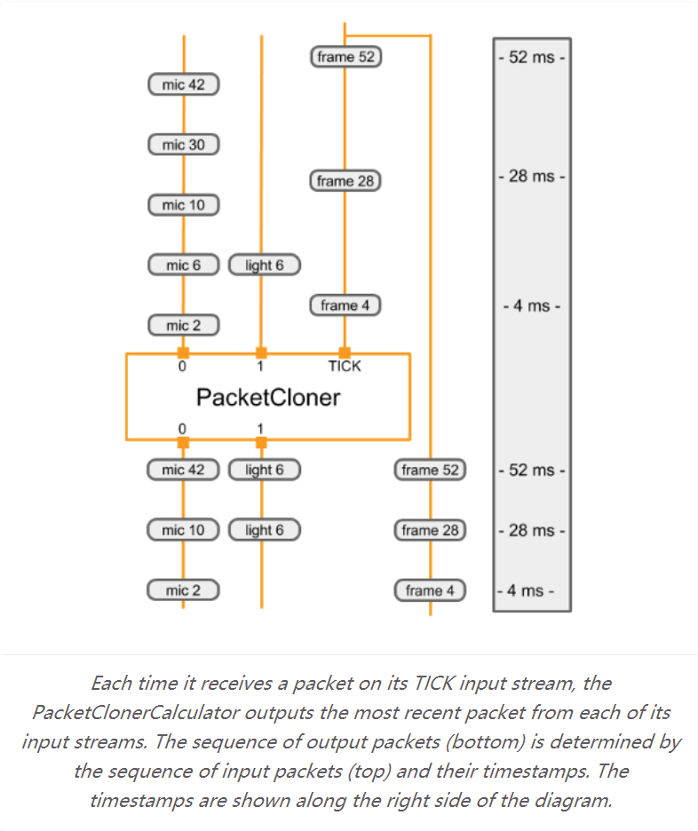
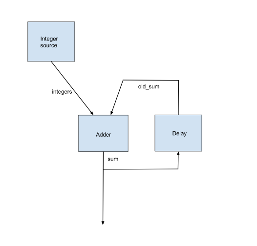
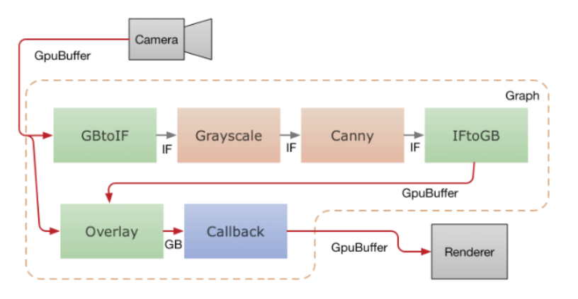

# Framework Concepts

[TOC]

## The basics

### Calculators

1. [CalculatorBase](https://google.github.io/mediapipe/framework_concepts/calculators.html#calculatorbase)
2. [Life of a calculator](https://google.github.io/mediapipe/framework_concepts/calculators.html#life-of-a-calculator)
3. [Identifying inputs and outputs](https://google.github.io/mediapipe/framework_concepts/calculators.html#identifying-inputs-and-outputs)
4. [Processing](https://google.github.io/mediapipe/framework_concepts/calculators.html#processing)
5. [Calculator options](https://google.github.io/mediapipe/framework_concepts/calculators.html#calculator-options)
6. [Example calculator](https://google.github.io/mediapipe/framework_concepts/calculators.html#example-calculator)

Each calculator is a node of a graph. We describe how to create a new calculator, how to initialize a calculator, how to perform its calculations, input and output streams, timestamps, and options. Each node in the graph is implemented as a `Calculator`. The bulk of graph execution happens inside its calculators. A calculator may receive zero or more input **streams** and/or **side packets** and produces zero or more output streams and/or side packets.

每个计算器都是图形的一个节点。我们描述了如何创建新计算器、如何初始化计算器、如何执行计算、输入和输出流、时间戳和选项。**图中的每个节点都实现为一个计算器。**大部分图形执行发生在其计算器内。计算器可以接收零个或多个输入流和/或侧包并产生零个或多个输出流和/或侧包。

#### CalculatorBase

A calculator is created by defining a new sub-class of the [CalculatorBase](https://github.com/google/mediapipe/tree/master/mediapipe/framework/calculator_base.cc) class, implementing a number of methods, and registering the new sub-class with Mediapipe. At a minimum, a new calculator must implement the below four methods

计算器是通过定义 CalculatorBase 类的新子类、实现许多方法以及向 Mediapipe 注册新子类来创建的。一个新的计算器至少必须实现以下四种方法

- `GetContract()`

Calculator authors can specify the expected types of inputs and outputs of a calculator in `GetContract()`. When a graph is initialized, the framework calls a static method to verify if the packet types of the connected inputs and outputs match the information in this specification.

Calculator创建者可以在 GetContract() 中指定计算器的预期输入和输出类型。初始化图时，框架调用静态方法来验证连接的输入和输出的数据包类型是否与本规范中的信息匹配。

- `Open()`

After a graph starts, the framework calls `Open()`. The input side packets are available to the calculator at this point. `Open()` interprets the node configuration operations (see [Graphs](https://google.github.io/mediapipe/framework_concepts/graphs.html)) and prepares the calculator’s per-graph-run state. This function may also write packets to calculator outputs. An error during `Open()` can terminate the graph run.

图启动后，框架调用 Open()。此时输入端数据包可供计算器使用。 Open() 解释节点配置操作（参见图表）并准备计算器的每个图表运行状态。该函数还可以将数据包写入计算器输出。 Open() 期间的错误可能会终止图形运行。

- `Process()`

For a calculator with inputs, the framework calls `Process()` repeatedly whenever at least one input stream has a packet available. The framework by default guarantees that all inputs have the same timestamp (see [Synchronization](https://google.github.io/mediapipe/framework_concepts/synchronization.html) for more information). Multiple `Process()` calls can be invoked simultaneously when parallel execution is enabled. If an error occurs during `Process()`, the framework calls `Close()` and the graph run terminates.

对于具有输入的计算器，只要至少一个输入流有可用的数据包，框架就会重复调用 Process()。默认情况下，框架保证所有输入都具有相同的时间戳（有关更多信息，请参阅同步）。启用并行执行时，可以同时调用多个 Process() 调用。如果在 Process() 期间发生错误，框架将调用 Close() 并且图形运行终止。

- `Close()`

After all calls to `Process()` finish or when all input streams close, the framework calls `Close()`. This function is always called if `Open()` was called and succeeded and even if the graph run terminated because of an error. No inputs are available via any input streams during `Close()`, but it still has access to input side packets and therefore may write outputs. After `Close()` returns, the calculator should be considered a dead node. The calculator object is destroyed as soon as the graph finishes running.

在对 Process() 的所有调用完成或所有输入流关闭后，框架将调用 Close()。如果调用 Open() 并成功，则始终调用此函数，即使图形运行因错误而终止。在 Close() 期间没有通过任何输入流获得输入，但它仍然可以访问输入端数据包，因此可以写入输出。 Close() 返回后，计算器应被视为死节点。一旦图形完成运行，计算器对象就会被销毁。


The following are code snippets from [CalculatorBase.h](https://github.com/google/mediapipe/tree/master/mediapipe/framework/calculator_base.h).

```c++
class CalculatorBase {
 public:
  ...

  // The subclasses of CalculatorBase must implement GetContract.
  // ...
  static absl::Status GetContract(CalculatorContract* cc);

  // Open is called before any Process() calls, on a freshly constructed
  // calculator.  Subclasses may override this method to perform necessary
  // setup, and possibly output Packets and/or set output streams' headers.
  // ...
  virtual absl::Status Open(CalculatorContext* cc) {
    return absl::OkStatus();
  }

  // Processes the incoming inputs. May call the methods on cc to access
  // inputs and produce outputs.
  // ...
  virtual absl::Status Process(CalculatorContext* cc) = 0;

  // Is called if Open() was called and succeeded.  Is called either
  // immediately after processing is complete or after a graph run has ended
  // (if an error occurred in the graph).  ...
  virtual absl::Status Close(CalculatorContext* cc) {
    return absl::OkStatus();
  }

  ...
};
```


#### Life of a calculator

During initialization of a MediaPipe graph, the framework calls a `GetContract()` static method to determine what kinds of packets are expected.

在 MediaPipe 图的初始化期间，框架调用 GetContract() 静态方法来确定预期的数据包类型。

The framework constructs and destroys the entire calculator for each graph run (e.g. once per video or once per image). Expensive or large objects that remain constant across graph runs should be supplied as input side packets so the calculations are not repeated on subsequent runs.

该框架为每次图形运行构建和销毁整个计算器（例如，每个视频一次或每个图像一次）。在图形运行中保持不变的昂贵或大型对象应作为输入侧数据包提供，以便在后续运行中不会重复计算。

After initialization, for each run of the graph, the following sequence occurs:

- `Open()`
- `Process()` (repeatedly)
- `Close()`

The framework calls `Open()` to initialize the calculator. `Open()` should interpret any options and set up the calculator’s per-graph-run state. `Open()` may obtain input side packets and write packets to calculator outputs. If appropriate, it should call `SetOffset()` to reduce potential packet buffering of input streams.

框架调用 Open() 来初始化计算器。Open()应该解释任何选项并设置计算器的每个图形运行状态。Open()可以获取输入端数据包并将数据包写入计算器输出。如果合适，它应该调用SetOffset()来减少输入流的潜在数据包缓冲。

If an error occurs during `Open()` or `Process()` (as indicated by one of them returning a non-`Ok` status), the graph run is terminated with no further calls to the calculator’s methods, and the calculator is destroyed.

如果在Open()或Process()期间发生错误（如其中之一返回非Ok状态所示），图形运行将终止，不再调用计算器的方法，并且计算器被摧毁。

For a calculator with inputs, the framework calls `Process()` whenever at least one input has a packet available. The framework guarantees that inputs all have the same timestamp, that timestamps increase with each call to `Process()` and that all packets are delivered. As a consequence, some inputs may not have any packets when `Process()` is called. An input whose packet is missing appears to produce an empty packet (with no timestamp).

对于带有输入的计算器，只要至少一个输入有可用的数据包，框架就会调用Process()。该框架保证所有输入都具有相同的时间戳，时间戳随着对Process()的每次调用而增加，并且所有数据包都被传送。因此，当调用 Process() 时，某些输入可能没有任何数据包。丢失数据包的输入似乎会产生一个空数据包（没有时间戳）。

The framework calls `Close()` after all calls to `Process()`. All inputs will have been exhausted, but `Close()` has access to input side packets and may write outputs. After Close returns, the calculator is destroyed.

框架在所有调用 Process() 之后调用 Close() 。所有输入都将被耗尽，但Close()可以访问输入端数据包并可以写入输出。 Close 返回后，计算器被销毁。

Calculators with no inputs are referred to as sources. A source calculator continues to have `Process()` called as long as it returns an `Ok` status. A source calculator indicates that it is exhausted by returning a stop status (i.e. MediaPipe::tool::StatusStop).

没有输入的计算器被称为源。只要源计算器返回“Ok”状态，它就会继续调用Process()。源计算器通过返回停止状态（即 MediaPipe::tool::StatusStop）来指示它已耗尽。


#### Identifying inputs and outputs  -- 注册输入输出

The public interface to a calculator consists of a set of input streams and output streams. In a CalculatorGraphConfiguration, the outputs from some calculators are connected to the inputs of other calculators using named streams. Stream names are normally lowercase, while input and output tags are normally UPPERCASE. In the example below, the output with tag name `VIDEO` is connected to the input with tag name `VIDEO_IN` using the stream named `video_stream`.

计算器的公共接口由一组输入流和输出流组成。在 CalculatorGraphConfiguration 中，一些计算器的输出使用命名流连接到其他计算器的输入。流名称通常为小写，而输入和输出标签通常为大写。在下面的示例中，标签名称为 VIDEO 的输出使用名为 video_stream 的流连接到标签名称为 VIDEO_IN 的输入。

```python
# Graph describing calculator SomeAudioVideoCalculator
node {
  calculator: "SomeAudioVideoCalculator"
  input_stream: "INPUT:combined_input"
  output_stream: "VIDEO:video_stream"
}
node {
  calculator: "SomeVideoCalculator"
  input_stream: "VIDEO_IN:video_stream"
  output_stream: "VIDEO_OUT:processed_video"
}
```

Input and output streams can be identified by index number, by tag name, or by a combination of tag name and index number. You can see some examples of input and output identifiers in the example below. `SomeAudioVideoCalculator` identifies its video output by tag and its audio outputs by the combination of tag and index. The input with tag `VIDEO` is connected to the stream named `video_stream`. The outputs with tag `AUDIO` and indices `0` and `1` are connected to the streams named `audio_left` and `audio_right`. `SomeAudioCalculator` identifies its audio inputs by index only (no tag needed).

输入和输出流可以通过索引号、标签名或标签名和索引号的组合来标识。您可以在下面的示例中看到一些输入和输出标识符的示例。 SomeAudioVideoCalculator 通过标签标识其视频输出，通过标签和索引的组合标识其音频输出。带有标签 VIDEO 的输入连接到名为 video_stream 的流。带有标签 AUDIO 和索引 0 和 1 的输出连接到名为 audio_left 和 audio_right 的流。 SomeAudioCalculator 仅通过索引识别其音频输入（不需要标签）。

```python 
# Graph describing calculator SomeAudioVideoCalculator
node {
  calculator: "SomeAudioVideoCalculator"
  input_stream: "combined_input"
  output_stream: "VIDEO:video_stream"
  output_stream: "AUDIO:0:audio_left"
  output_stream: "AUDIO:1:audio_right"
}

node {
  calculator: "SomeAudioCalculator"
  input_stream: "audio_left"
  input_stream: "audio_right"
  output_stream: "audio_energy"
}
```

In the calculator implementation, inputs and outputs are also identified by tag name and index number. In the function below input and output are identified:

在计算器实现中，输入和输出也由标签名称和索引号标识。在下面的函数中，输入和输出被识别：

- By index number: The combined input stream is identified simply by index `0`.

  按索引号：组合输入流由索引“0”简单标识。

- By tag name: The video output stream is identified by tag name “VIDEO”.

  按标签名称：视频输出流由标签名称“VIDEO”标识。

- By tag name and index number: The output audio streams are identified by the combination of the tag name `AUDIO` and the index numbers `0` and `1`.

  通过标签名称和索引号：输出音频流由标签名称`AUDIO`和索引号`0`和`1`的组合标识。

```c++
// c++ Code snippet describing the SomeAudioVideoCalculator GetContract() method
class SomeAudioVideoCalculator : public CalculatorBase {
 public:
  static absl::Status GetContract(CalculatorContract* cc) {
    cc->Inputs().Index(0).SetAny();
    // SetAny() is used to specify that whatever the type of the
    // stream is, it's acceptable.  This does not mean that any
    // packet is acceptable.  Packets in the stream still have a
    // particular type.  SetAny() has the same effect as explicitly
    // setting the type to be the stream's type.
    cc->Outputs().Tag("VIDEO").Set<ImageFrame>();
    cc->Outputs().Get("AUDIO", 0).Set<Matrix>();
    cc->Outputs().Get("AUDIO", 1).Set<Matrix>();
    return absl::OkStatus();
  }
```


#### Processing

`Process()` called on a non-source node must return `absl::OkStatus()` to indicate that all went well, or any other status code to signal an error.

在非源节点上调用的 Process() 必须返回 absl::OkStatus() 以指示一切顺利，或任何其他状态代码以发出错误信号

If a non-source calculator returns `tool::StatusStop()`, then this signals the graph is being cancelled early. In this case, all source calculators and graph input streams will be closed (and remaining Packets will propagate through the graph).

如果非源计算器返回tool::StatusStop()，那么这表明图形被提前取消。在这种情况下，所有源计算器和图形输入流将被关闭（并且剩余的数据包将通过图形传播）。

A source node in a graph will continue to have `Process()` called on it as long as it returns `absl::OkStatus(`). To indicate that there is no more data to be generated return `tool::StatusStop()`. Any other status indicates an error has occurred.

图中的源节点将继续调用 Process()，只要它返回 absl::OkStatus()。为了表明没有更多的数据要生成，返回tool::StatusStop()。任何其他状态都表示发生了错误。

`Close()` returns `absl::OkStatus()` to indicate success. Any other status indicates a failure.

```
Close() 返回 absl::OkStatus() 表示成功。任何其他状态都表示失败。
```

Here is the basic `Process()` function. It uses the `Input()` method (which can be used only if the calculator has a single input) to request its input data. It then uses `std::unique_ptr` to allocate the memory needed for the output packet, and does the calculations. When done it releases the pointer when adding it to the output stream.

这是基本的Process()函数。它使用 Input() 方法（只有在计算器只有一个输入时才可以使用）来请求它的输入数据。然后它使用 std::unique_ptr 来分配输出数据包所需的内存，并进行计算。完成后，它会在将指针添加到输出流时释放指针。

```c++
absl::Status MyCalculator::Process() {
  const Matrix& input = Input()->Get<Matrix>();
  std::unique_ptr<Matrix> output(new Matrix(input.rows(), input.cols()));
  // do your magic here....
  //    output->row(n) =  ...
  Output()->Add(output.release(), InputTimestamp());
  return absl::OkStatus();
}
```


#### Calculator options

Calculators accept processing parameters through (1) input stream packets (2) input side packets, and (3) calculator options. Calculator options, if specified, appear as literal values in the `node_options` field of the `CalculatorGraphConfiguration.Node` message.

计算器通过 (1) 输入流数据包 (2) 输入端数据包和 (3) 计算器选项接受处理参数。计算器选项（如果指定）在 CalculatorGraphConfiguration.Node 消息的 node_options 字段中显示为文字值。

```python
  node {
    calculator: "TfLiteInferenceCalculator"
    input_stream: "TENSORS:main_model_input"
    output_stream: "TENSORS:main_model_output"
    node_options: {
      [type.googleapis.com/mediapipe.TfLiteInferenceCalculatorOptions] {
        model_path: "mediapipe/models/detection_model.tflite"
      }
    }
  }
```

The `node_options` field accepts the proto3 syntax. Alternatively, calculator options can be specified in the `options` field using proto2 syntax.

node_options 字段接受 proto3 语法。或者，可以使用 proto2 语法在选项字段中指定计算器选项。

```python 
  node {
    calculator: "TfLiteInferenceCalculator"
    input_stream: "TENSORS:main_model_input"
    output_stream: "TENSORS:main_model_output"
    node_options: {
      [type.googleapis.com/mediapipe.TfLiteInferenceCalculatorOptions] {
        model_path: "mediapipe/models/detection_model.tflite"
      }
    }
  }
```

Not all calculators accept calcuator options. In order to accept options, a calculator will normally define a new protobuf message type to represent its options, such as `PacketClonerCalculatorOptions`. The calculator will then read that protobuf message in its `CalculatorBase::Open` method, and possibly also in its `CalculatorBase::GetContract` function or its `CalculatorBase::Process` method. Normally, the new protobuf message type will be defined as a protobuf schema using a “.proto” file and a `mediapipe_proto_library()` build rule.

并非所有计算器都接受计算器选项。为了接受选项，计算器通常会定义一个新的 protobuf 消息类型来表示其选项，例如 PacketClonerCalculatorOptions。然后计算器将在其 CalculatorBase::Open 方法中读取该 protobuf 消息，也可能在其 CalculatorBase::GetContract 函数或 CalculatorBase::Process 方法中读取该 protobuf 消息。通常，新的 protobuf 消息类型将使用“.proto”文件和 mediapipe_proto_library() 构建规则定义为 protobuf 模式。

```python 
  mediapipe_proto_library(
      name = "packet_cloner_calculator_proto",
      srcs = ["packet_cloner_calculator.proto"],
      visibility = ["//visibility:public"],
      deps = [
          "//mediapipe/framework:calculator_options_proto",
          "//mediapipe/framework:calculator_proto",
      ],
  )
```


#### Example calculator

This section discusses the implementation of `PacketClonerCalculator`, which does a relatively simple job, and is used in many calculator graphs. `PacketClonerCalculator` simply produces a copy of its most recent input packets on demand.

本节讨论“PacketClonerCalculator”的实现，它完成了一个相对简单的工作，并用于许多计算器图形中。 `PacketClonerCalculator` 只需根据需要生成其最新输入数据包的副本。

`PacketClonerCalculator` is useful when the timestamps of arriving data packets are not aligned perfectly. Suppose we have a room with a microphone, light sensor and a video camera that is collecting sensory data. Each of the sensors operates independently and collects data intermittently. Suppose that the output of each sensor is:

- microphone = loudness in decibels of sound in the room (Integer)
- light sensor = brightness of room (Integer)
- video camera = RGB image frame of room (ImageFrame)

`PacketClonerCalculator` 在到达数据包的时间戳没有完全对齐时很有用。假设我们有一个房间，里面有麦克风、光传感器和一个正在收集感官数据的摄像机。每个传感器独立运行并间歇性地收集数据。假设每个传感器的输出为：
	--- 麦克风 = 房间中声音的响度（以分贝为单位）（整数）
	--- 光传感器 = 房间亮度（整数）
	--- 摄像机 = 房间的 RGB 图像帧 (ImageFrame)

Our simple perception pipeline is designed to process sensory data from these 3 sensors such that at any time when we have image frame data from the camera that is synchronized with the last collected microphone loudness data and light sensor brightness data. To do this with MediaPipe, our perception pipeline has 3 input streams:

- room_mic_signal - Each packet of data in this input stream is integer data representing how loud audio is in a room with timestamp.
- room_lightening_sensor - Each packet of data in this input stream is integer data representing how bright is the room illuminated with timestamp.
- room_video_tick_signal - Each packet of data in this input stream is imageframe of video data representing video collected from camera in the room with timestamp.

我们的简单感知管道旨在处理来自这 3 个传感器的感官数据，以便在我们从相机获得与最后收集的麦克风响度数据和光传感器亮度数据同步的图像帧数据的任何时候。为了使用 MediaPipe，我们的感知管道有 3 个输入流：
- room_mic_signal - 此输入流中的每个数据包都是整数数据，表示带有时间戳的房间中的音频响度。
- room_lightening_sensor - 此输入流中的每个数据包都是整数数据，表示用时间戳照亮的房间有多亮。
- room_video_tick_signal - 此输入流中的每个数据包都是视频数据的图像帧，表示从房间中的摄像机收集的带有时间戳的视频。

Below is the implementation of the `PacketClonerCalculator`. You can see the `GetContract()`, `Open()`, and `Process()` methods as well as the instance variable `current_` which holds the most recent input packets.

下面是“PacketClonerCalculator”的实现。你可以看到`GetContract()`、`Open()`和`Process()`方法以及保存最新输入数据包的实例变量`current_`。下面是`PacketClonerCalculator`的实现。您可以看到`GetContract()`、`Open()` 和`Process()` 方法以及保存最新输入数据包的实例变量`current_`。

```c++
// This takes packets from N+1 streams, A_1, A_2, ..., A_N, B.
// For every packet that appears in B, outputs the most recent packet from each
// of the A_i on a separate stream.

#include <vector>

#include "absl/strings/str_cat.h"
#include "mediapipe/framework/calculator_framework.h"

namespace mediapipe {

// For every packet received on the last stream, output the latest packet
// obtained on all other streams. Therefore, if the last stream outputs at a
// higher rate than the others, this effectively clones the packets from the
// other streams to match the last.
//
// Example config:
// node {
//   calculator: "PacketClonerCalculator"
//   input_stream: "first_base_signal"
//   input_stream: "second_base_signal"
//   input_stream: "tick_signal"
//   output_stream: "cloned_first_base_signal"
//   output_stream: "cloned_second_base_signal"
// }
//
class PacketClonerCalculator : public CalculatorBase {
 public:
  static absl::Status GetContract(CalculatorContract* cc) {
    const int tick_signal_index = cc->Inputs().NumEntries() - 1;
    // cc->Inputs().NumEntries() returns the number of input streams
    // for the PacketClonerCalculator
    for (int i = 0; i < tick_signal_index; ++i) {
      cc->Inputs().Index(i).SetAny();
      // cc->Inputs().Index(i) returns the input stream pointer by index
      cc->Outputs().Index(i).SetSameAs(&cc->Inputs().Index(i));
    }
    cc->Inputs().Index(tick_signal_index).SetAny();
    return absl::OkStatus();
  }

  absl::Status Open(CalculatorContext* cc) final {
    tick_signal_index_ = cc->Inputs().NumEntries() - 1;
    current_.resize(tick_signal_index_);
    // Pass along the header for each stream if present.
    for (int i = 0; i < tick_signal_index_; ++i) {
      if (!cc->Inputs().Index(i).Header().IsEmpty()) {
        cc->Outputs().Index(i).SetHeader(cc->Inputs().Index(i).Header());
        // Sets the output stream of index i header to be the same as
        // the header for the input stream of index i
      }
    }
    return absl::OkStatus();
  }

  absl::Status Process(CalculatorContext* cc) final {
    // Store input signals.
    for (int i = 0; i < tick_signal_index_; ++i) {
      if (!cc->Inputs().Index(i).Value().IsEmpty()) {
        current_[i] = cc->Inputs().Index(i).Value();
      }
    }

    // Output if the tick signal is non-empty.
    if (!cc->Inputs().Index(tick_signal_index_).Value().IsEmpty()) {
      for (int i = 0; i < tick_signal_index_; ++i) {
        if (!current_[i].IsEmpty()) {
          cc->Outputs().Index(i).AddPacket(
              current_[i].At(cc->InputTimestamp()));
          // Add a packet to output stream of index i a packet from inputstream i
          // with timestamp common to all present inputs
        } else {
          cc->Outputs().Index(i).SetNextTimestampBound(
              cc->InputTimestamp().NextAllowedInStream());
          // if current_[i], 1 packet buffer for input stream i is empty, we will set
          // next allowed timestamp for input stream i to be current timestamp + 1
        }
      }
    }
    return absl::OkStatus();
  }

 private:
  std::vector<Packet> current_;
  int tick_signal_index_;
};

REGISTER_CALCULATOR(PacketClonerCalculator);
}  // namespace mediapipe
```

Typically, a calculator has only a .cc file. No .h is required, because mediapipe uses registration to make calculators known to it. After you have defined your calculator class, register it with a macro invocation REGISTER_CALCULATOR(calculator_class_name).

通常，计算器只有一个 .cc 文件。不需要 .h，因为 mediapipe 使用注册来使其知道计算器。定义计算器类后，使用宏调用 REGISTER_CALCULATOR(calculator_class_name) 注册它。

Below is a trivial MediaPipe graph that has 3 input streams, 1 node (PacketClonerCalculator) and 2 output streams.

下面是一个简单的 MediaPipe 图，它有 3 个输入流、1 个节点 (PacketClonerCalculator) 和 2 个输出流。

```python 
input_stream: "room_mic_signal"
input_stream: "room_lighting_sensor"
input_stream: "room_video_tick_signal"

node {
   calculator: "PacketClonerCalculator"
   input_stream: "room_mic_signal"
   input_stream: "room_lighting_sensor"
   input_stream: "room_video_tick_signal"
   output_stream: "cloned_room_mic_signal"
   output_stream: "cloned_lighting_sensor"
 }
```

The diagram below shows how the `PacketClonerCalculator` defines its output packets (bottom) based on its series of input packets (top).

下图显示了 `PacketClonerCalculator` 如何根据其一系列输入数据包（顶部）定义其输出数据包（底部）。



*Each time it receives a packet on its TICK input stream, the PacketClonerCalculator outputs the most recent packet from each of its input streams. The sequence of output packets (bottom) is determined by the sequence of input packets (top) and their timestamps. The timestamps are shown along the right side of the diagram.*

每次在其 TICK 输入流上接收到一个数据包时，PacketClonerCalculator 都会从其每个输入流中输出最新的数据包。输出数据包的序列（底部）由输入数据包的序列（顶部）及其时间戳决定。时间戳显示在图表的右侧。


### Packet

The basic data flow unit. A packet consists of a numeric timestamp and a shared pointer to an **immutable** payload. The payload can be of any C++ type, and the payload’s type is also referred to as the type of the packet. Packets are value classes and can be copied cheaply. Each copy shares ownership of the payload, with reference-counting semantics. Each copy has its own timestamp. See also [Packet](https://google.github.io/mediapipe/framework_concepts/packets.html).

基本数据流单元。packet由数字时间戳和指向不可变负载的共享指针组成。有效载荷可以是任何 C++ 类型，有效载荷的类型也称为packet的类型。packets是价值类，可以廉价地复制。每个副本共享有效负载的所有权，具有引用计数语义。每个副本都有自己的时间戳。

Calculators communicate by sending and receiving packets. Typically a single packet is sent along each input stream at each input timestamp. A packet can contain any kind of data, such as a single frame of video or a single integer detection count.

Calculators通过发送和接收数据包进行通信。通常，在每个输入时间戳沿每个输入流发送单个数据包。数据包可以包含任何类型的数据，例如单个视频帧或单个整数检测计数。

#### Creating a packet

Packets are generally created with `mediapipe::MakePacket<T>()` or `mediapipe::Adopt()` (from packet.h).

```c++
// Create a packet containing some new data.
Packet p = MakePacket<MyDataClass>("constructor_argument");
// Make a new packet with the same data and a different timestamp.
Packet p2 = p.At(Timestamp::PostStream());
```

```c++
// Create some new data.
auto data = absl::make_unique<MyDataClass>("constructor_argument");
// Create a packet to own the data.
Packet p = Adopt(data.release()).At(Timestamp::PostStream());
```

Data within a packet is accessed with `Packet::Get<T>()`


### Graph

MediaPipe processing takes place inside a graph, which defines packet flow paths between **nodes**. A graph can have any number of inputs and outputs, and data flow can branch and merge. Generally data flows forward, but backward loops are possible. See [Graphs](https://google.github.io/mediapipe/framework_concepts/graphs.html) for details.

MediaPipe 处理发生在一个Graph中，它定义了Node之间的数据包流路径。图可以有任意数量的输入和输出，数据流可以分支和合并。通常数据向前流动，但反向循环也是可能的。

1. [GraphConfig](https://google.github.io/mediapipe/framework_concepts/graphs.html#graphconfig)
2. [Subgraph](https://google.github.io/mediapipe/framework_concepts/graphs.html#subgraph)
3. Cycles
   1. [Back Edge Annotation](https://google.github.io/mediapipe/framework_concepts/graphs.html#back-edge-annotation)
   2. [Initial Packet](https://google.github.io/mediapipe/framework_concepts/graphs.html#initial-packet)
   3. [Delay in a Loop](https://google.github.io/mediapipe/framework_concepts/graphs.html#delay-in-a-loop)
   4. [Early Termination of a Calculator When One Input Stream is Done](https://google.github.io/mediapipe/framework_concepts/graphs.html#early-termination-of-a-calculator-when-one-input-stream-is-done)
   5. Relevant Source Code
      1. [Delay Calculator](https://google.github.io/mediapipe/framework_concepts/graphs.html#delay-calculator)
      2. [Graph Config](https://google.github.io/mediapipe/framework_concepts/graphs.html#graph-config)


#### GraphConfig

A `GraphConfig` is a specification that describes the topology and functionality of a MediaPipe graph. In the specification, a node in the graph represents an instance of a particular calculator. All the necessary configurations of the node, such its type, inputs and outputs must be described in the specification. Description of the node can also include several optional fields, such as node-specific options, input policy and executor, discussed in [Synchronization](https://google.github.io/mediapipe/framework_concepts/synchronization.html).

GraphConfig 是描述 MediaPipe 图的拓扑和功能的规范。在规范中，图中的节点表示特定Calculator的实例。节点的所有必要配置，例如其类型、输入和输出，都必须在规范中进行描述。node的描述还可以包括几个可选字段，例如节点特定的选项、输入策略和执行程序，在同步中讨论。

`GraphConfig` has several other fields to configure the global graph-level settings, eg, graph executor configs, number of threads, and maximum queue size of input streams. Several graph-level settings are useful for tuning the performance of the graph on different platforms (eg, desktop v.s. mobile). For instance, on mobile, attaching a heavy model-inference calculator to a separate executor can improve the performance of a real-time application since this enables thread locality.

GraphConfig 有几个其他字段来配置全局图级设置，例如，图执行器配置、线程数和输入流的最大队列大小。一些图形级别的设置对于在不同平台（例如，桌面与移动）上调整图形的性能很有用。例如，在移动设备上，将繁重的模型推理calculator附加到单独的执行器可以提高实时应用程序的性能，因为这可以实现线程局部性。

Below is a trivial `GraphConfig` example where we have series of passthrough calculators(直通计算器) :

```python
# This graph named main_pass_throughcals_nosubgraph.pbtxt contains 4
# passthrough calculators.
input_stream: "in"
node {
    calculator: "PassThroughCalculator"
    input_stream: "in"
    output_stream: "out1"
}
node {
    calculator: "PassThroughCalculator"
    input_stream: "out1"
    output_stream: "out2"
}
node {
    calculator: "PassThroughCalculator"
    input_stream: "out2"
    output_stream: "out3"
}
node {
    calculator: "PassThroughCalculator"
    input_stream: "out3"
    output_stream: "out4"
}
```

#### Subgraph

To modularize a `CalculatorGraphConfig` into sub-modules and assist with re-use of perception solutions, a MediaPipe graph can be defined as a `Subgraph`. The public interface of a subgraph consists of a set of input and output streams similar to a calculator’s public interface. The subgraph can then be included in an `CalculatorGraphConfig` as if it were a calculator. When a MediaPipe graph is loaded from a `CalculatorGraphConfig`, each subgraph node is replaced by the corresponding graph of calculators. As a result, the semantics and performance of the subgraph is identical to the corresponding graph of calculators.

为了将 CalculatorGraphConfig 模块化为子模块并协助感知解决方案的重用，可以将 MediaPipe graph定义为Subgraph。Subgraph的公共接口由一组输入和输出流组成，类似于calculator的公共接口。然后可以将Subgraph包含在CalculatorGraphConfig中，就像它是一个calculator一样。当从 CalculatorGraphConfig 加载 MediaPipe graph时，每个subgraph node都被相应的计算器图替换。因此，子图的语义和性能与计算器的相应图相同。

Below is an example of how to create a subgraph named `TwoPassThroughSubgraph`.

1.  **Defining the subgraph.**

```python
# This subgraph is defined in two_pass_through_subgraph.pbtxt
# and is registered as "TwoPassThroughSubgraph"

type: "TwoPassThroughSubgraph"
input_stream: "out1"
output_stream: "out3"

node {
    calculator: "PassThroughCalculator"
    input_stream: "out1"
    output_stream: "out2"
}
node {
    calculator: "PassThroughCalculator"
    input_stream: "out2"
    output_stream: "out3"
}
```

The public interface to the subgraph consists of:

- Graph input streams
- Graph output streams
- Graph input side packets
- Graph output side packets


2. **Register the subgraph using BUILD rule `mediapipe_simple_subgraph`. The parameter `register_as` defines the component name for the new subgraph.**

注册子图

```python
# Small section of BUILD file for registering the "TwoPassThroughSubgraph"
# subgraph for use by main graph main_pass_throughcals.pbtxt

mediapipe_simple_subgraph(
    name = "twopassthrough_subgraph",
    graph = "twopassthrough_subgraph.pbtxt",
    register_as = "TwoPassThroughSubgraph",
    deps = [
            "//mediapipe/calculators/core:pass_through_calculator",
            "//mediapipe/framework:calculator_graph",
    ],
)
```


3. **Use the subgraph in the main graph.**

```python
# This main graph is defined in main_pass_throughcals.pbtxt
# using subgraph called "TwoPassThroughSubgraph"

input_stream: "in"
node {
    calculator: "PassThroughCalculator"
    input_stream: "in"
    output_stream: "out1"
}
node {
    calculator: "TwoPassThroughSubgraph"
    input_stream: "out1"
    output_stream: "out3"
}
node {
    calculator: "PassThroughCalculator"
    input_stream: "out3"
    output_stream: "out4"
}
```


#### Cycles

By default, MediaPipe requires calculator graphs to be **acyclic** and treats cycles in a graph as errors. If a graph is intended to have cycles, the cycles need to be annotated in the graph config. This page describes how to do that.

默认情况下，MediaPipe 要求计算器图形是非循环的，并将图形中的循环视为错误。如果图打算有循环，则需要在图配置中注释循环。

NOTE: The current approach is experimental and subject to change. We welcome your feedback.

Please use the `CalculatorGraphTest.Cycle` unit test in `mediapipe/framework/calculator_graph_test.cc` as sample code. Shown below is the cyclic graph in the test. The `sum` output of the adder is the sum of the integers generated by the integer source calculator.

请使用 mediapipe/framework/calculator_graph_test.cc 中的 CalculatorGraphTest.Cycle 单元测试作为示例代码。下面显示的是测试中的循环图。加法器的总和输出是整数源计算器生成的整数之和。



This simple graph illustrates all the issues in supporting cyclic graphs.

这个简单的图说明了支持循环图的所有问题。

- **Back Edge Annotation**

We require that an edge in each cycle be annotated as a back edge. This allows MediaPipe’s **topological sort** to work, after removing all the back edges.

我们要求每个循环中的一条边被注释为后边。这允许 MediaPipe 的拓扑排序在移除所有后边缘后工作。

There are usually multiple ways to select the back edges. Which edges are marked as back edges affects which nodes are considered as upstream and which nodes are considered as downstream, which in turn affects the priorities MediaPipe assigns to the nodes.

通常有多种方法可以选择后边。哪些边被标记为后边会影响哪些节点被视为上游，哪些节点被视为下游，进而影响 MediaPipe 分配给节点的优先级。

For example, the `CalculatorGraphTest.Cycle` test marks the `old_sum` edge as a back edge, so the Delay node is considered as a downstream node of the adder node and is given a higher priority. Alternatively, we could mark the `sum` input to the delay node as the back edge, in which case the delay node would be considered as an upstream node of the adder node and is given a lower priority.

例如，CalculatorGraphTest.Cycle 测试将old_sum 边标记为后边，因此Delay 节点被视为加法器节点的下游节点，并被赋予更高的优先级。或者，我们可以将延迟节点的和输入标记为后边缘，在这种情况下，延迟节点将被视为加法器节点的上游节点，并被赋予较低的优先级。

- **Initial Packet**

For the adder calculator to be runnable when the first integer from the integer source arrives, we need an initial packet, with value 0 and with the same timestamp, on the `old_sum` input stream to the adder. This initial packet should be output by the delay calculator in the `Open()` method.

当来自整数源的第一个整数到达时，为了使加法器计算器可运行，我们需要在加法器的 old_sum 输入流上有一个初始数据包，其值为 0 且具有相同的时间戳。这个初始数据包应该由 Open() 方法中的延迟计算器输出。

- **Delay in a Loop** 

Each loop should incur a delay to align the previous `sum` output with the next integer input. This is also done by the delay node. So the delay node needs to know the following about the timestamps of the integer source calculator:

​	---- The timestamp of the first output.

​	---- The timestamp delta between successive outputs.

We plan to add an alternative scheduling policy that only cares about packet ordering and ignores packet timestamps, which will eliminate this inconvenience.

每个循环都应产生延迟，以将前一个sum输出与下一个整数输入对齐。这也是由延迟节点完成的。所以延迟节点需要知道以下关于整数源计算器的时间戳：
	--- 第一个输出的时间戳。
	--- 连续输出之间的时间戳增量。
我们计划添加一个替代的调度策略，它只关心数据包排序而忽略数据包时间戳，这将消除这种不便。

- **Early Termination of a Calculator When One Input Stream is Done**

By default, MediaPipe calls the `Close()` method of a non-source calculator when all of its input streams are done. In the example graph, we want to stop the adder node as soon as the integer source is done. This is accomplished by configuring the adder node with an alternative input stream handler, `EarlyCloseInputStreamHandler`.

默认情况下，MediaPipe 在其所有输入流完成后调用非源计算器的 Close() 方法。在示例图中，我们希望在整数源完成后立即停止加法器节点。这是通过使用替代输入流处理程序 EarlyCloseInputStreamHandler 配置加法器节点来实现的。

- **Relevant Source Code**

**DELAY CALCULATOR**

Note the code in `Open()` that outputs the initial packet and the code in `Process()` that adds a (unit) delay to input packets. As noted above, this delay node assumes that its output stream is used alongside an input stream with packet timestamps 0, 1, 2, 3, …

请注意 Open() 中输出初始数据包的代码和 Process() 中为输入数据包添加（单位）延迟的代码。如上所述，该延迟节点假定其输出流与数据包时间戳为 0、1、2、3、...的输入流一起使用。

```c++
class UnitDelayCalculator : public Calculator {
 public:
  static absl::Status FillExpectations(
      const CalculatorOptions& extendable_options, PacketTypeSet* inputs,
      PacketTypeSet* outputs, PacketTypeSet* input_side_packets) {
    inputs->Index(0)->Set<int>("An integer.");
    outputs->Index(0)->Set<int>("The input delayed by one time unit.");
    return absl::OkStatus();
  }

  absl::Status Open() final {
    Output()->Add(new int(0), Timestamp(0));
    return absl::OkStatus();
  }

  absl::Status Process() final {
    const Packet& packet = Input()->Value();
    Output()->AddPacket(packet.At(packet.Timestamp().NextAllowedInStream()));
    return absl::OkStatus();
  }
};
```

​	**GRAPH CONFIG**

Note the `back_edge` annotation and the alternative `input_stream_handler`.

```python
node {
  calculator: 'GlobalCountSourceCalculator'
  input_side_packet: 'global_counter'
  output_stream: 'integers'
}
node {
  calculator: 'IntAdderCalculator'
  input_stream: 'integers'
  input_stream: 'old_sum'
  input_stream_info: {
    tag_index: ':1'  # 'old_sum'
    back_edge: true
  }
  output_stream: 'sum'
  input_stream_handler {
    input_stream_handler: 'EarlyCloseInputStreamHandler'
  }
}
node {
  calculator: 'UnitDelayCalculator'
  input_stream: 'sum'
  output_stream: 'old_sum'
}
```


### Nodes

Nodes produce and/or consume packets, and they are where the bulk of the graph’s work takes place. They are also known as “calculators”, for historical reasons. Each node’s interface defines a number of input and output **ports**, identified by a tag and/or an index. See [Calculators](https://google.github.io/mediapipe/framework_concepts/calculators.html) for details.

节点产生和/或消耗数据包，它们是大部分图形工作发生的地方。由于历史原因，它们也被称为“计算器”。每个节点的接口定义了许多输入和输出端口，由标签和/或索引标识。


### Streams

A stream is a connection between two nodes that carries a sequence of packets, whose timestamps must be monotonically increasing.

流是两个节点之间的连接，它携带一系列数据包，其时间戳必须单调递增。


### Side packets

A side packet connection between nodes carries a single packet (with unspecified timestamp). It can be used to provide some data that will remain constant, whereas a stream represents a flow of data that changes over time.

节点之间的侧数据包连接承载单个数据包（具有未指定的时间戳）。它可用于提供一些保持不变的数据，而流表示随时间变化的数据流。


### Packet Ports

A port has an associated type; packets transiting through the port must be of that type. An output stream port can be connected to any number of input stream ports of the same type; each consumer receives a separate copy of the output packets, and has its own queue, so it can consume them at its own pace. Similarly, a side packet output port can be connected to as many side packet input ports as desired.

一个端口有一个关联的类型；通过端口传输的数据包必须属于该类型。一个输出流端口可以连接到任意数量的相同类型的输入流端口；每个消费者都会收到一份单独的输出数据包副本，并拥有自己的队列，因此可以按照自己的节奏使用它们。类似地，侧包输出端口可以根据需要连接到任意多的侧包输入端口。

A port can be required, meaning that a connection must be made for the graph to be valid, or optional, meaning it may remain unconnected.

端口可能是必需的，这意味着必须建立连接才能使图形有效，或者是可选的，这意味着它可能保持未连接状态。

Note: even if a stream connection is required, the stream may not carry a packet for all timestamps.

注意：即使需要流连接，流也可能不会携带所有时间戳的数据包。


## Input and output

Data flow can originate from **source nodes**, which have no input streams and produce packets spontaneously (e.g. by reading from a file); or from **graph input streams**, which let an application feed packets into a graph.

数据流可以源自源节点，这些节点没有输入流并自发地产生数据包（例如通过从文件中读取）；或者来自图形输入流，它让应用程序将数据包输入到图形中。

Similarly, there are **sink nodes** that receive data and write it to various destinations (e.g. a file, a memory buffer, etc.), and an application can also receive output from the graph using **callbacks**.

类似地，有接收数据并将其写入不同目的地（例如文件、内存缓冲区等）的接收节点，应用程序也可以使用回调从图中接收输出。


## Runtime behavior

### Graph lifetime

Once a graph has been initialized, it can be **started** to begin processing data, and can process a stream of packets until each stream is closed or the graph is **canceled**. Then the graph can be destroyed or **started** again.

一旦一个图被初始化，它就可以**开始**开始处理数据，并且可以处理一个数据包流，直到每个流被关闭或图被**取消**。然后图形可以被销毁或再次**启动**。

### Node lifetime

There are three main lifetime methods the framework will call on a node:

- Open: called once, before the other methods. When it is called, all input side packets required by the node will be available.
- Process: called multiple times, when a new set of inputs is available, according to the node’s input policy.
- Close: called once, at the end.

In addition, each calculator can define constructor and destructor, which are useful for creating and deallocating resources that are independent of the processed data.

框架将在节点上调用三种主要的生命周期方法：

- 打开：在其他方法之前调用一次。当它被调用时，节点所需的所有输入端数据包都将可用。
- 过程：根据节点的输入策略，当一组新的输入可用时，多次调用。
- 关闭：在最后调用一次。

此外，每个计算器都可以定义构造函数和析构函数，这对于创建和释放与处理数据无关的资源很有用。

### Input policies

The default input policy is deterministic collation of packets by timestamp. A node receives all inputs for the same timestamp at the same time, in an invocation of its Process method; and successive input sets are received in their timestamp order. This can require delaying the processing of some packets until a packet with the same timestamp is received on all input streams, or until it can be guaranteed that a packet with that timestamp will not be arriving on the streams that have not received it.

默认输入策略是按时间戳确定性整理数据包。一个节点在调用其 Process 方法时同时接收相同时间戳的所有输入；并按时间戳顺序接收连续的输入集。这可能需要延迟对某些数据包的处理，直到在所有输入流上都接收到具有相同时间戳的数据包，或者直到可以保证具有该时间戳的数据包不会到达尚未收到它的流上。

Other policies are also available, implemented using a separate kind of component known as an InputStreamHandler.

其他策略也可用，使用一种称为 InputStreamHandler 的单独组件来实现。

See [Synchronization](https://google.github.io/mediapipe/framework_concepts/synchronization.html) for more details.

### Real-time streams

MediaPipe calculator graphs are often used to process streams of video or audio frames for interactive applications. Normally, each Calculator runs as soon as all of its input packets for a given timestamp become available. Calculators used in real-time graphs need to define output timestamp bounds based on input timestamp bounds in order to allow downstream calculators to be scheduled promptly. See [Real-time Streams](https://google.github.io/mediapipe/framework_concepts/realtime_streams.html) for details.

MediaPipe 计算器图形通常用于处理交互式应用程序的视频或音频帧流。通常，一旦给定时间戳的所有输入数据包可用，每个计算器就会运行。实时图形中使用的计算器需要根据输入时间戳边界定义输出时间戳边界，以便及时调度下游计算器。


## Synchronization

1. [Scheduling mechanics](https://google.github.io/mediapipe/framework_concepts/synchronization.html#scheduling-mechanics)
2. [Timestamp Synchronization](https://google.github.io/mediapipe/framework_concepts/synchronization.html#timestamp-synchronization)
3. [Input policies](https://google.github.io/mediapipe/framework_concepts/synchronization.html#input-policies)
4. [Flow control](https://google.github.io/mediapipe/framework_concepts/synchronization.html#flow-control)

### Scheduling mechanics  --- 调度机制

Data processing in a MediaPipe graph occurs inside processing nodes defined as [CalculatorBase](https://github.com/google/mediapipe/tree/master/mediapipe/framework/calculator_base.h) subclasses. The scheduling system decides when each calculator should run.

MediaPipe 图中的数据处理发生在定义为 CalculatorBase 子类的处理节点内。调度系统决定每个计算器的运行时间。

Each graph has at least one **scheduler queue**. Each scheduler queue has exactly one **executor**. Nodes are statically assigned to a queue (and therefore to an executor). By default there is one queue, whose executor is a thread pool with a number of threads based on the system’s capabilities.

每个图至少有一个**调度器队列**。每个调度器队列只有一个**executor**。节点被静态分配给一个队列（并因此分配给一个执行器）。默认情况下有一个队列，它的执行者是一个线程池，根据系统的能力有多个线程。

Each node has a scheduling state, which can be *not ready*, *ready*, or *running*. A readiness function determines whether a node is ready to run. This function is invoked at graph initialization, whenever a node finishes running, and whenever the state of a node’s inputs changes.

每个节点都有一个调度状态，可以是not ready、ready或running。准备功能确定节点是否准备好运行。该函数在图初始化时、节点完成运行时以及节点输入的状态发生变化时调用。

The readiness function used depends on the type of node. A node with no stream inputs is known as a **source node**; source nodes are always ready to run, until they tell the framework they have no more data to output, at which point they are closed.

使用的就绪函数取决于节点的类型。没有流输入的**节点**称为**源节点**；源节点总是准备好运行，直到它们告诉框架它们没有更多的数据要输出，此时它们被关闭。

Non-source nodes are ready if they have inputs to process, and if those inputs form a valid input set according to the conditions set by the node’s **input policy** (discussed below). Most nodes use the default input policy, but some nodes specify a different one.

如果非源节点有要处理的输入，并且这些输入根据节点的**输入策略**（下文讨论）设置的条件形成有效输入集，则它们已准备就绪。大多数节点使用默认输入策略，但有些节点指定不同的输入策略。

Note: Because changing the input policy changes the guarantees the calculator’s code can expect from its inputs, it is not generally possible to mix and match calculators with arbitrary input policies. Thus a calculator that uses a special input policy should be written for it, and declare it in its contract.

注意：由于更改输入策略会更改计算器代码可以从其输入中获得的保证，因此通常不可能将计算器与任意输入策略混合和匹配。因此，应为其编写使用特殊输入策略的计算器，并在其合约中声明。

When a node becomes ready, a task is added to the corresponding scheduler queue, which is a priority queue. The priority function is currently fixed, and takes into account static properties of the nodes and their topological sorting within the graph. For example, nodes closer to the output side of the graph have higher priority, while source nodes have the lowest priority.

当一个节点准备好时，一个任务被添加到相应的调度器队列中，这是一个优先级队列。优先级函数目前是固定的，并考虑了节点的静态属性及其在图中的拓扑排序。例如，靠近图输出侧的节点具有更高的优先级，而源节点具有最低的优先级。

Each queue is served by an executor, which is responsible for actually running the task by invoking the calculator’s code. Different executors can be provided and configured; this can be used to customize the use of execution resources, e.g. by running certain nodes on lower-priority threads.

每个队列由一个执行程序提供服务，执行程序负责通过调用计算器的代码实际运行任务。可以提供和配置不同的执行器；这可用于自定义执行资源的使用，例如通过在较低优先级线程上运行某些节点。


### Timestamp Synchronization --- 时间戳同步

MediaPipe graph execution is decentralized: there is no global clock, and different nodes can process data from different timestamps at the same time. This allows higher throughput via pipelining.

MediaPipe 图执行是去中心化的：没有全局时钟，不同节点可以同时处理来自不同时间戳的数据。这允许通过流水线获得更高的吞吐量。

However, time information is very important for many perception workflows. Nodes that receive multiple input streams generally need to coordinate them in some way. For example, an object detector may output a list of boundary rectangles from a frame, and this information may be fed into a rendering node, which should process it together with the original frame.

然而，时间信息对于许多感知工作流程非常重要。接收多个输入流的节点通常需要以某种方式协调它们。例如，对象检测器可以从帧中输出边界矩形的列表，并且该信息可以被馈送到渲染节点，渲染节点应该将其与原始帧一起处理。

Therefore, one of the key responsibilities of the MediaPipe framework is to provide input synchronization for nodes. In terms of framework mechanics, the primary role of a timestamp is to serve as a **synchronization key**.

因此，MediaPipe 框架的关键职责之一是为节点提供输入同步。在框架机制方面，时间戳的主要作用是充当**同步密钥**。

Furthermore, MediaPipe is designed to support deterministic operations, which is important in many scenarios (testing, simulation, batch processing, etc.), while allowing graph authors to relax determinism where needed to meet real-time constraints.

此外，MediaPipe 旨在支持确定性操作，这在许多场景（测试、模拟、批处理等）中都很重要，同时允许图作者在需要满足实时约束的情况下放宽确定性。

The two objectives of synchronization and determinism underlie several design choices. Notably, the packets pushed into a given stream must have monotonically increasing timestamps: this is not just a useful assumption for many nodes, but it is also relied upon by the synchronization logic. Each stream has a **timestamp bound**, which is the lowest possible timestamp allowed for a new packet on the stream. When a packet with timestamp `T` arrives, the bound automatically advances to `T+1`, reflecting the monotonic requirement. This allows the framework to know for certain that no more packets with timestamp lower than `T` will arrive.

同步和确定性这两个目标是多种设计选择的基础。值得注意的是，推送到给定流中的数据包必须具有单调递增的时间戳：这不仅是许多节点的有用假设，而且同步逻辑也依赖于此。每个流都有一个**时间戳边界**，这是流上新数据包允许的最低可能时间戳。当带有时间戳的数据包`T`到达时，边界自动前进到`T+1`，反映了单调要求。这允许框架确定不会再有时间戳低于的数据包`T`到达。


### Input policies   --- 输入策略

Synchronization is handled locally on each node, using the input policy specified by the node.

同步在每个节点上本地处理，使用节点指定的输入策略。

The default input policy, defined by [DefaultInputStreamHandler](https://github.com/google/mediapipe/tree/master/mediapipe/framework/stream_handler/default_input_stream_handler.h), provides deterministic synchronization of inputs, with the following guarantees:

- If packets with the same timestamp are provided on multiple input streams, they will always be processed together regardless of their arrival order in real time.
- Input sets are processed in strictly ascending timestamp order.
- No packets are dropped, and the processing is fully deterministic.
- The node becomes ready to process data as soon as possible given the guarantees above.

由定义的默认输入策略[DefaultInputStreamHandler](https://github.com/google/mediapipe/tree/master/mediapipe/framework/stream_handler/default_input_stream_handler.h)提供输入的确定性同步，并具有以下保证：

- 如果在多个输入流上提供具有相同时间戳的数据包，它们将始终被一起处理，而不管它们的实时到达顺序如何。
- 输入集以严格的时间戳升序进行处理。
- 没有数据包被丢弃，并且处理是完全确定的。
- 鉴于上述保证，节点准备尽快处理数据。

Note: An important consequence of this is that if the calculator always uses the current input timestamp when outputting packets, the output will inherently obey the monotonically increasing timestamp requirement.

注意：这样做的一个重要后果是，如果计算器在输出数据包时始终使用当前输入时间戳，则输出将固有地遵守单调递增的时间戳要求。

Warning: On the other hand, it is not guaranteed that an input packet will always be available for all streams.

警告：另一方面，不能保证输入数据包始终可用于所有流。

To explain how it works, we need to introduce the definition of a settled timestamp. We say that a timestamp in a stream is *settled* if it lower than the timestamp bound. In other words, a timestamp is settled for a stream once the state of the input at that timestamp is irrevocably known: either there is a packet, or there is the certainty that a packet with that timestamp will not arrive.

为了解释它是如何工作的，我们需要介绍一个固定时间戳的定义。我们说，在流中的时间戳*解决*，如果不是绑定的时间戳降低。换句话说，一旦在时间戳上的输入状态不可撤销地知道，就会为流确定时间戳：要么存在数据包，要么确定具有该时间戳的数据包不会到达。

Note: For this reason, MediaPipe also allows a stream producer to explicitly advance the timestamp bound farther that what the last packet implies, i.e. to provide a tighter bound. This can allow the downstream nodes to settle their inputs sooner.

注意：出于这个原因，MediaPipe 还允许流生产者显式地将时间戳边界提前到最后一个数据包所暗示的范围，即提供更严格的边界。这可以允许下游节点更快地确定其输入。

A timestamp is settled across multiple streams if it is settled on each of those streams. Furthermore, if a timestamp is settled it implies that all previous timestamps are also settled. Thus settled timestamps can be processed deterministically in ascending order.

如果时间戳在这些流中的每一个上建立，则时间戳跨多个流建立。此外，如果时间戳已确定，则意味着所有先前的时间戳也已确定。因此，可以按升序确定性地处理已解决的时间戳。

Given this definition, a calculator with the default input policy is ready if there is a timestamp which is settled across all input streams and contains a packet on at least one input stream. The input policy provides all available packets for a settled timestamp as a single *input set* to the calculator.

鉴于此定义，如果存在跨所有输入流确定的时间戳并且包含至少一个输入流上的数据包，则具有默认输入策略的计算器已准备就绪。输入策略为固定时间戳提供所有可用数据包作为计算器的单个*输入集*。

One consequence of this deterministic behavior is that, for nodes with multiple input streams, there can be a theoretically unbounded wait for a timestamp to be settled, and an unbounded number of packets can be buffered in the meantime. (Consider a node with two input streams, one of which keeps sending packets while the other sends nothing and does not advance the bound.)

这种确定性行为的一个后果是，对于具有多个输入流的节点，理论上可以无限等待时间戳的确定，同时可以缓冲无限数量的数据包。（考虑一个具有两个输入流的节点，其中一个不断发送数据包，而另一个不发送任何内容并且不推进边界。）

Therefore, we also provide for custom input policies: for example, splitting the inputs in different synchronization sets defined by [SyncSetInputStreamHandler](https://github.com/google/mediapipe/tree/master/mediapipe/framework/stream_handler/sync_set_input_stream_handler.h), or avoiding synchronization altogether and processing inputs immediately as they arrive defined by [ImmediateInputStreamHandler](https://github.com/google/mediapipe/tree/master/mediapipe/framework/stream_handler/immediate_input_stream_handler.h).

因此，我们还提供了自定义输入策略：例如，将输入拆分为 [SyncSetInputStreamHandler](https://github.com/google/mediapipe/tree/master/mediapipe/framework/stream_handler/sync_set_input_stream_handler. h)，或完全避免同步并在输入到达时立即处理由 [ImmediateInputStreamHandler](https://github.com/google/mediapipe/tree/master/mediapipe/framework/stream_handler/immediate_input_stream_handler.h) 定义的输入。


### Flow control   --- 流控制

There are two main flow control mechanisms. A backpressure mechanism throttles the execution of upstream nodes when the packets buffered on a stream reach a (configurable) limit defined by [CalculatorGraphConfig::max_queue_size](https://github.com/google/mediapipe/tree/master/mediapipe/framework/calculator.proto). This mechanism maintains deterministic behavior, and includes a deadlock avoidance system that relaxes configured limits when needed.

有两种主要的流量控制机制。当缓冲在流上的数据包达到由 定义的（可配置）限制时，背压机制会限制上游节点的执行[CalculatorGraphConfig::max_queue_size](https://github.com/google/mediapipe/tree/master/mediapipe/framework/calculator.proto)。该机制保持确定性行为，并包括一个死锁避免系统，可在需要时放宽配置的限制。

The second system consists of inserting special nodes which can drop packets according to real-time constraints (typically using custom input policies) defined by [FlowLimiterCalculator](https://github.com/google/mediapipe/tree/master/mediapipe/calculators/core/flow_limiter_calculator.cc). For example, a common pattern places a flow-control node at the input of a subgraph, with a loopback connection from the final output to the flow-control node. The flow-control node is thus able to keep track of how many timestamps are being processed in the downstream graph, and drop packets if this count hits a (configurable) limit; and since packets are dropped upstream, we avoid the wasted work that would result from partially processing a timestamp and then dropping packets between intermediate stages.

第二个系统包括插入特殊节点，这些节点可以根据由 定义的实时约束（通常使用自定义输入策略）丢弃数据包[FlowLimiterCalculator](https://github.com/google/mediapipe/tree/master/mediapipe/calculators/core/flow_limiter_calculator.cc)。例如，一个常见的模式在子图的输入端放置一个流控制节点，从最终输出到流控制节点有一个环回连接。因此，流控制节点能够跟踪下游图中正在处理的时间戳数量，并在此计数达到（可配置）限制时丢弃数据包；并且由于数据包在上游被丢弃，我们避免了由于部分处理时间戳然后在中间阶段之间丢弃数据包而导致的工作浪费。

This calculator-based approach gives the graph author control of where packets can be dropped, and allows flexibility in adapting and customizing the graph’s behavior depending on resource constraints.

这种基于计算器的方法使图作者可以控制可以丢弃数据包的位置，并允许根据资源限制灵活地调整和自定义图的行为。


## Real-time Streams  --- 实时流

1. [Real-time timestamps](https://google.github.io/mediapipe/framework_concepts/realtime_streams.html#real-time-timestamps)
2. [Real-time scheduling](https://google.github.io/mediapipe/framework_concepts/realtime_streams.html#real-time-scheduling)
3. [Timestamp bounds](https://google.github.io/mediapipe/framework_concepts/realtime_streams.html#timestamp-bounds)
4. [Propagating timestamp bounds](https://google.github.io/mediapipe/framework_concepts/realtime_streams.html#propagating-timestamp-bounds)
5. [Scheduling of Calculator::Open and Calculator::Close](https://google.github.io/mediapipe/framework_concepts/realtime_streams.html#scheduling-of-calculatoropen-and-calculatorclose)


### Real-time timestamps  -- 实时时间戳

MediaPipe calculator graphs are often used to process streams of video or audio frames for interactive applications. The MediaPipe framework requires only that successive packets be assigned monotonically increasing timestamps. By convention, real-time calculators and graphs use the recording time or the presentation time of each frame as its timestamp, with each timestamp indicating the microseconds since `Jan/1/1970:00:00:00`. This allows packets from various sources to be processed in a globally consistent sequence.

MediaPipe 计算器图形通常用于处理交互式应用程序的视频或音频帧流。MediaPipe 框架只要求为连续的数据包分配单调递增的时间戳。按照惯例，实时计算器和图形使用每帧的记录时间或呈现时间作为其时间戳，每个时间戳表示自 以来的微秒`Jan/1/1970:00:00:00`。这允许以全局一致的顺序处理来自各种来源的数据包。


### Real-time scheduling   --- 实时调度

Normally, each Calculator runs as soon as all of its input packets for a given timestamp become available. Normally, this happens when the calculator has finished processing the previous frame, and each of the calculators producing its inputs have finished processing the current frame. The MediaPipe scheduler invokes each calculator as soon as these conditions are met. See [Synchronization](https://google.github.io/mediapipe/framework_concepts/synchronization.html) for more details.

通常，一旦给定时间戳的所有输入数据包可用，每个计算器就会运行。通常，当计算器完成处理前一帧，并且产生其输入的每个计算器完成处理当前帧时，就会发生这种情况。一旦满足这些条件，MediaPipe 调度程序就会调用每个计算器。


### Timestamp bounds  --- 时间戳边界

When a calculator does not produce any output packets for a given timestamp, it can instead output a “timestamp bound” indicating that no packet will be produced for that timestamp. This indication is necessary to allow downstream calculators to run at that timestamp, even though no packet has arrived for certain streams for that timestamp. This is especially important for real-time graphs in interactive applications, where it is crucial that each calculator begin processing as soon as possible.

当计算器没有为给定的时间戳生成任何输出数据包时，它可以输出一个“时间戳边界”，指示不会为该时间戳生成任何数据包。该指示对于允许下游计算器在该时间戳运行是必要的，即使对于该时间戳的某些流没有数据包到达也是如此。这对于交互式应用程序中的实时图形尤其重要，其中每个计算器尽快开始处理至关重要。

Consider a graph like the following:

```python
node {
   calculator: "A"
   input_stream: "alpha_in"
   output_stream: "alpha"
}
node {
   calculator: "B"
   input_stream: "alpha"
   input_stream: "foo"
   output_stream: "beta"
}
```

Suppose: at timestamp `T`, node `A` doesn’t send a packet in its output stream `alpha`. Node `B` gets a packet in `foo` at timestamp `T` and is waiting for a packet in `alpha` at timestamp `T`. If `A` doesn’t send `B` a timestamp bound update for `alpha`, `B` will keep waiting for a packet to arrive in `alpha`. Meanwhile, the packet queue of `foo` will accumulate packets at `T`, `T+1` and so on.

假设：在timestamp 处`T`，节点`A`不在其输出流中发送数据包`alpha`。节点`B`得到一个数据包中`foo`的时间戳`T`和等待数据包`alpha`的时间戳`T`。如果`A`不发送`B`时间戳绑定更新`alpha`，`B`将继续等待数据包到达`alpha`。同时， `foo`的数据包队列将在`T`，`T+1`，... 处累积数据包。

To output a packet on a stream, a calculator uses the API functions `CalculatorContext::Outputs` and `OutputStream::Add`. To instead output a timestamp bound on a stream, a calculator can use the API functions `CalculatorContext::Outputs` and `CalculatorContext::SetNextTimestampBound`. The specified bound is the lowest allowable timestamp for the next packet on the specified output stream. When no packet is output, a calculator will typically do something like:

为了在流上输出数据包，计算器使用 API 函数`CalculatorContext::Outputs`和`OutputStream::Add`. 为了代替在流上输出时间戳，计算器可以使用 API 函数`CalculatorContext::Outputs`和`CalculatorContext::SetNextTimestampBound`. 指定的界限是指定输出流上下一个数据包的最低允许时间戳。当没有数据包输出时，计算器通常会执行以下操作：

```c++
cc->Outputs().Tag("output_frame").SetNextTimestampBound(
  cc->InputTimestamp().NextAllowedInStream());
```

The function `Timestamp::NextAllowedInStream` returns the successive timestamp. For example, `Timestamp(1).NextAllowedInStream() == Timestamp(2)`.

该函数`Timestamp::NextAllowedInStream`返回连续的时间戳。例如，`Timestamp(1).NextAllowedInStream() == Timestamp(2)`。


### Propagating timestamp bounds -- 传播时间戳边界

Calculators that will be used in real-time graphs need to define output timestamp bounds based on input timestamp bounds in order to allow downstream calculators to be scheduled promptly. A common pattern is for calculators to output packets with the same timestamps as their input packets. In this case, simply outputting a packet on every call to `Calculator::Process` is sufficient to define output timestamp bounds.

将在实时图形中使用的计算器需要根据输入时间戳边界定义输出时间戳边界，以便及时安排下游计算器。一个常见的模式是计算器输出与输入数据包具有相同时间戳的数据包。在这种情况下，只需在每次调用时输出一个数据包就`Calculator::Process`足以定义输出时间戳边界。

However, calculators are not required to follow this common pattern for output timestamps, they are only required to choose monotonically increasing output timestamps. As a result, certain calculators must calculate timestamp bounds explicitly. MediaPipe provides several tools for computing appropriate timestamp bound for each calculator.

但是，计算器不需要遵循这种常见的输出时间戳模式，它们只需要选择单调递增的输出时间戳即可。因此，某些计算器必须明确计算时间戳界限。MediaPipe 提供了多种工具来为每个计算器计算适当的时间戳界限。

1. **SetNextTimestampBound()** can be used to specify the timestamp bound, `t + 1`, for an output stream. **SetNextTimestampBound()**可用于指定`t + 1`输出流的时间戳界限。

```c++
cc->Outputs.Tag("OUT").SetNextTimestampBound(t.NextAllowedInStream());
```

Alternatively, an empty packet with timestamp `t` can be produced to specify the timestamp bound `t + 1`. 或者，`t`可以生成带有时间戳的空包来指定时间戳边界`t + 1`。

```c++
cc->Outputs.Tag("OUT").Add(Packet(), t);
```

The timestamp bound of an input stream is indicated by the packet or the empty packet on the input stream. 输入流的时间戳边界由输入流上的数据包或空数据包指示。

```c++
Timestamp bound = cc->Inputs().Tag("IN").Value().Timestamp();
```

2. **TimestampOffset()** can be specified in order to automatically copy the timestamp bound from input streams to output streams. 可以指定**TimestampOffset()**以自动将时间戳绑定从输入流复制到输出流。

```c++
cc->SetTimestampOffset(0);
```

This setting has the advantage of propagating timestamp bounds automatically, even when only timestamp bounds arrive and Calculator::Process is not invoked. 此设置具有自动传播时间戳边界的优点，即使只有时间戳边界到达且未调用 Calculator::Process 也是如此。

3. **ProcessTimestampBounds()** can be specified in order to invoke `Calculator::Process` for each new “settled timestamp”, where the “settled timestamp” is the new highest timestamp below the current timestamp bounds. Without `ProcessTimestampBounds()`, `Calculator::Process` is invoked only with one or more arriving packets. 可以指定**ProcessTimestampBounds()**以便`Calculator::Process`为每个新的“已解决时间戳”调用，其中“已解决时间戳”是低于当前时间戳边界的新的最高时间戳。没有`ProcessTimestampBounds()`,`Calculator::Process`仅在一个或多个到达数据包时调用。

```c++
cc->SetProcessTimestampBounds(true);
```

This setting allows a calculator to perform its own timestamp bounds calculation and propagation, even when only input timestamps are updated. It can be used to replicate the effect of `TimestampOffset()`, but it can also be used to calculate a timestamp bound that takes into account additional factors. 此设置允许计算器执行其自己的时间戳边界计算和传播，即使仅更新输入时间戳也是如此。它可用于复制 的效果`TimestampOffset()`，但也可用于计算考虑其他因素的时间戳界限。

For example, in order to replicate `SetTimestampOffset(0)`, a calculator could do the following:

例如，为了复制`SetTimestampOffset(0)`，计算器可以执行以下操作：

```c++
absl::Status Open(CalculatorContext* cc) {
  cc->SetProcessTimestampBounds(true);
}

absl::Status Process(CalculatorContext* cc) {
  cc->Outputs.Tag("OUT").SetNextTimestampBound(
      cc->InputTimestamp().NextAllowedInStream());
}
```


### Scheduling of Calculator::Open and Calculator::Close

`Calculator::Open` is invoked when all required input side-packets have been produced. Input side-packets can be provided by the enclosing application or by “side-packet calculators” inside the graph. Side-packets can be specified from outside the graph using the API’s `CalculatorGraph::Initialize` and `CalculatorGraph::StartRun`. Side packets can be specified by calculators within the graph using `CalculatorGraphConfig::OutputSidePackets` and `OutputSidePacket::Set`.

`Calculator::Open`当所有必需的输入侧包都已生成时调用。输入侧包可以由封闭的应用程序或图中的“侧包计算器”提供。可以使用 API 的`CalculatorGraph::Initialize`和从图外部指定侧包`CalculatorGraph::StartRun`。可以使用`CalculatorGraphConfig::OutputSidePackets`和由图形中的计算器指定边数据包`OutputSidePacket::Set`。

Calculator::Close is invoked when all of the input streams have become `Done` by being closed or reaching timestamp bound `Timestamp::Done`.

当所有输入流都已`Done`关闭或达到时间戳边界时，将调用 Calculator::Close `Timestamp::Done`。

**Note:** If the graph finishes all pending calculator execution and becomes `Done`, before some streams become `Done`, then MediaPipe will invoke the remaining calls to `Calculator::Close`, so that every calculator can produce its final outputs.

**注意：**如果图完成了所有挂起的计算器执行并变为`Done`，则在某些`Done`流变为之前，MediaPipe 将调用剩余的对 的调用`Calculator::Close`，以便每个计算器都可以产生其最终输出。

The use of `TimestampOffset` has some implications for `Calculator::Close`. A calculator specifying `SetTimestampOffset(0)` will by design signal that all of its output streams have reached `Timestamp::Done` when all of its input streams have reached `Timestamp::Done`, and therefore no further outputs are possible. This prevents such a calculator from emitting any packets during `Calculator::Close`. If a calculator needs to produce a summary packet during `Calculator::Close`, `Calculator::Process` must specify timestamp bounds such that at least one timestamp (such as `Timestamp::Max`) remains available during `Calculator::Close`. This means that such a calculator normally cannot rely upon `SetTimestampOffset(0)` and must instead specify timestamp bounds explicitly using `SetNextTimestampBounds()`.

`TimestampOffset` 的使用对 `Calculator::Close` 有一些影响。指定`SetTimestampOffset(0)` 的计算器将在其所有输入流都达到`Timestamp::Done` 时发出信号，表明其所有输出流都已达到`Timestamp::Done`，因此不可能有进一步的输出。这可以防止此类计算器在“Calculator::Close”期间发出任何数据包。如果计算器需要在 `Calculator::Close` 期间生成汇总数据包，则 `Calculator::Process` 必须指定时间戳边界，以便在 `Calculator:: `期间至少有一个时间戳（例如 `Timestamp::Max`）保持可用关闭。这意味着此类计算器通常不能依赖于`SetTimestampOffset(0)`，而必须使`SetNextTimestampBounds()`明确指定时间戳边界。


## GPU

1. [Overview](https://google.github.io/mediapipe/framework_concepts/gpu.html#overview)
2. [OpenGL ES Support](https://google.github.io/mediapipe/framework_concepts/gpu.html#opengl-es-support)
3. [Life of a GPU Calculator](https://google.github.io/mediapipe/framework_concepts/gpu.html#life-of-a-gpu-calculator)
4. [GpuBuffer to ImageFrame Converters](https://google.github.io/mediapipe/framework_concepts/gpu.html#gpubuffer-to-imageframe-converters)


### Overview

MediaPipe supports calculator nodes for GPU compute and rendering, and allows combining multiple GPU nodes, as well as mixing them with CPU based calculator nodes. There exist several GPU APIs on mobile platforms (eg, OpenGL ES, Metal and Vulkan). MediaPipe does not attempt to offer a single cross-API GPU abstraction. Individual nodes can be written using different APIs, allowing them to take advantage of platform specific features when needed.

MediaPipe 支持用于 GPU 计算和渲染的计算器节点，并允许组合多个 GPU 节点，以及将它们与基于 CPU 的计算器节点混合。移动平台上存在多种 GPU API（例如，OpenGL ES、Metal 和 Vulkan）。MediaPipe 不会尝试提供单一的跨 API GPU 抽象。可以使用不同的 API 编写单个节点，从而允许它们在需要时利用特定于平台的功能。

GPU support is essential for good performance on mobile platforms, especially for real-time video. MediaPipe enables developers to write GPU compatible calculators that support the use of GPU for:

- On-device real-time processing, not just batch processing
- Video rendering and effects, not just analysis

GPU 支持对于移动平台上的良好性能至关重要，尤其是对于实时视频。MediaPipe 使开发人员能够编写 GPU 兼容的计算器，支持将 GPU 用于：

- 在设备上实时处理，而不仅仅是批处理
- 视频渲染和效果，而不仅仅是分析

Below are the design principles for GPU support in MediaPipe

- GPU-based calculators should be able to occur anywhere in the graph, and not necessarily be used for on-screen rendering.
- Transfer of frame data from one GPU-based calculator to another should be fast, and not incur expensive copy operations.
- Transfer of frame data between CPU and GPU should be as efficient as the platform allows.
- Because different platforms may require different techniques for best performance, the API should allow flexibility in the way things are implemented behind the scenes.
- A calculator should be allowed maximum flexibility in using the GPU for all or part of its operation, combining it with the CPU if necessary.

以下是 MediaPipe 中 GPU 支持的设计原则

- 基于 GPU 的计算器应该能够出现在图中的任何地方，不一定用于屏幕渲染。
- 将帧数据从一个基于 GPU 的计算器传输到另一个计算器应该很快，并且不会产生昂贵的复制操作。
- CPU 和 GPU 之间的帧数据传输应尽可能高效。
- 因为不同的平台可能需要不同的技术来获得最佳性能，所以 API 应该允许在幕后实现事物的方式上具有灵活性。
- 应允许计算器在使用 GPU 进行全部或部分操作时具有最大的灵活性，必要时将其与 CPU 结合使用。


### OpenGL ES Support

MediaPipe supports OpenGL ES up to version 3.2 on Android/Linux and up to ES 3.0 on iOS. In addition, MediaPipe also supports Metal on iOS.

MediaPipe 在 Android/Linux 上支持高达 3.2 版的 OpenGL ES，在 iOS 上支持高达 ES 3.0。此外，MediaPipe 还支持 iOS 上的 Metal。

OpenGL ES 3.1 or greater is required (on Android/Linux systems) for running machine learning inference calculators and graphs.

运行机器学习推理计算器和图形需要 OpenGL ES 3.1 或更高版本（在 Android/Linux 系统上）。

MediaPipe allows graphs to run OpenGL in multiple GL contexts. For example, this can be very useful in graphs that combine a slower GPU inference path (eg, at 10 FPS) with a faster GPU rendering path (eg, at 30 FPS): since one GL context corresponds to one sequential command queue, using the same context for both tasks would reduce the rendering frame rate.

MediaPipe 允许图形在多个 GL 上下文中运行 OpenGL。例如，这在将较慢的 GPU 推理路径（例如，10 FPS）与较快的 GPU 渲染路径（例如，30 FPS）相结合的图形中非常有用：因为一个 GL 上下文对应一个顺序命令队列，使用两个任务的相同上下文会降低渲染帧速率。

One challenge MediaPipe’s use of multiple contexts solves is the ability to communicate across them. An example scenario is one with an input video that is sent to both the rendering and inferences paths, and rendering needs to have access to the latest output from inference.

MediaPipe 使用多个上下文解决的一个挑战是在它们之间进行通信的能力。一个示例场景是一个输入视频被发送到渲染和推理路径，渲染需要访问推理的最新输出。

An OpenGL context cannot be accessed by multiple threads at the same time. Furthermore, switching the active GL context on the same thread can be slow on some Android devices. Therefore, our approach is to have one dedicated thread per context. Each thread issues GL commands, building up a serial command queue on its context, which is then executed by the GPU asynchronously.

多个线程不能同时访问 OpenGL 上下文。此外，在某些 Android 设备上，在同一线程上切换活动 GL 上下文可能会很慢。因此，我们的方法是每个上下文有一个专用线程。每个线程发出 GL 命令，在其上下文中建立一个串行命令队列，然后由 GPU 异步执行。


### Life of a GPU Calculator

This section presents the basic structure of the Process method of a GPU calculator derived from base class GlSimpleCalculator. The GPU calculator `LuminanceCalculator` is shown as an example. The method `LuminanceCalculator::GlRender` is called from `GlSimpleCalculator::Process`.

本节介绍派生自基类 GlSimpleCalculator 的 GPU 计算器的 Process 方法的基本结构。以 GPU 计算器`LuminanceCalculator`为例。该方法`LuminanceCalculator::GlRender`从 调用`GlSimpleCalculator::Process`。

```c++
// Converts RGB images into luminance images, still stored in RGB format.
// See GlSimpleCalculator for inputs, outputs and input side packets.
class LuminanceCalculator : public GlSimpleCalculator {
 public:
  absl::Status GlSetup() override;
  absl::Status GlRender(const GlTexture& src,
                        const GlTexture& dst) override;
  absl::Status GlTeardown() override;

 private:
  GLuint program_ = 0;
  GLint frame_;
};
REGISTER_CALCULATOR(LuminanceCalculator);

absl::Status LuminanceCalculator::GlRender(const GlTexture& src,
                                           const GlTexture& dst) {
  static const GLfloat square_vertices[] = {
      -1.0f, -1.0f,  // bottom left
      1.0f,  -1.0f,  // bottom right
      -1.0f, 1.0f,   // top left
      1.0f,  1.0f,   // top right
  };
  static const GLfloat texture_vertices[] = {
      0.0f, 0.0f,  // bottom left
      1.0f, 0.0f,  // bottom right
      0.0f, 1.0f,  // top left
      1.0f, 1.0f,  // top right
  };

  // program
  glUseProgram(program_);
  glUniform1i(frame_, 1);

  // vertex storage
  GLuint vbo[2];
  glGenBuffers(2, vbo);
  GLuint vao;
  glGenVertexArrays(1, &vao);
  glBindVertexArray(vao);

  // vbo 0
  glBindBuffer(GL_ARRAY_BUFFER, vbo[0]);
  glBufferData(GL_ARRAY_BUFFER, 4 * 2 * sizeof(GLfloat), square_vertices,
               GL_STATIC_DRAW);
  glEnableVertexAttribArray(ATTRIB_VERTEX);
  glVertexAttribPointer(ATTRIB_VERTEX, 2, GL_FLOAT, 0, 0, nullptr);

  // vbo 1
  glBindBuffer(GL_ARRAY_BUFFER, vbo[1]);
  glBufferData(GL_ARRAY_BUFFER, 4 * 2 * sizeof(GLfloat), texture_vertices,
               GL_STATIC_DRAW);
  glEnableVertexAttribArray(ATTRIB_TEXTURE_POSITION);
  glVertexAttribPointer(ATTRIB_TEXTURE_POSITION, 2, GL_FLOAT, 0, 0, nullptr);

  // draw
  glDrawArrays(GL_TRIANGLE_STRIP, 0, 4);

  // cleanup
  glDisableVertexAttribArray(ATTRIB_VERTEX);
  glDisableVertexAttribArray(ATTRIB_TEXTURE_POSITION);
  glBindBuffer(GL_ARRAY_BUFFER, 0);
  glBindVertexArray(0);
  glDeleteVertexArrays(1, &vao);
  glDeleteBuffers(2, vbo);

  return absl::OkStatus();
}
```

The design principles mentioned above have resulted in the following design choices for MediaPipe GPU support:

- We have a GPU data type, called `GpuBuffer`, for representing image data, optimized for GPU usage. The exact contents of this data type are opaque and platform-specific.
- A low-level API based on composition, where any calculator that wants to make use of the GPU creates and owns an instance of the `GlCalculatorHelper` class. This class offers a platform-agnostic API for managing the OpenGL context, setting up textures for inputs and outputs, etc.
- A high-level API based on subclassing, where simple calculators implementing image filters subclass from `GlSimpleCalculator` and only need to override a couple of virtual methods with their specific OpenGL code, while the superclass takes care of all the plumbing.
- Data that needs to be shared between all GPU-based calculators is provided as a external input that is implemented as a graph service and is managed by the `GlCalculatorHelper` class.
- The combination of calculator-specific helpers and a shared graph service allows us great flexibility in managing the GPU resource: we can have a separate context per calculator, share a single context, share a lock or other synchronization primitives, etc. – and all of this is managed by the helper and hidden from the individual calculators.

上述设计原则导致了以下 MediaPipe GPU 支持的设计选择：

- 我们有一个 GPU 数据类型，称为`GpuBuffer`，用于表示图像数据，针对 GPU 使用进行了优化。此数据类型的确切内容是不透明且特定于平台的。
- 基于组合的低级 API，任何想要使用 GPU 的计算器都会创建并拥有`GlCalculatorHelper`该类的实例。此类提供了一个与平台无关的 API，用于管理 OpenGL 上下文、为输入和输出设置纹理等。
- 基于子类化的高级 API，其中实现图像过滤器子类的简单计算器`GlSimpleCalculator`只需要使用其特定的 OpenGL 代码覆盖几个虚拟方法，而超类负责所有管道。
- 需要在所有基于 GPU 的计算器之间共享的数据作为外部输入提供，该输入实现为图形服务并由`GlCalculatorHelper`类管理。
- 特定于计算器的帮助程序和共享图形服务的组合使我们能够在管理 GPU 资源方面具有极大的灵活性：我们可以为每个计算器拥有一个单独的上下文、共享一个上下文、共享一个锁或其他同步原语等——以及所有这些这是由助手管理的，并且对单个计算器隐藏。


### GpuBuffer to ImageFrame Converters

We provide two calculators called `GpuBufferToImageFrameCalculator` and `ImageFrameToGpuBufferCalculator`. These calculators convert between `ImageFrame` and `GpuBuffer`, allowing the construction of graphs that combine GPU and CPU calculators. They are supported on both iOS and Android

我们提供两个名为`GpuBufferToImageFrameCalculator`和 的计算器`ImageFrameToGpuBufferCalculator`。这些计算器在`ImageFrame`和之间转换`GpuBuffer`，允许构建结合 GPU 和 CPU 计算器的图形。它们在 iOS 和 Android 上均受支持

When possible, these calculators use platform-specific functionality to share data between the CPU and the GPU without copying.

在可能的情况下，这些计算器使用特定于平台的功能在 CPU 和 GPU 之间共享数据而无需复制。

The below diagram shows the data flow in a mobile application that captures video from the camera, runs it through a MediaPipe graph, and renders the output on the screen in real time. The dashed line indicates which parts are inside the MediaPipe graph proper. This application runs a Canny edge-detection filter on the CPU using OpenCV, and overlays it on top of the original video using the GPU.

下图显示了移动应用程序中的数据流，该应用程序从摄像头捕获视频，通过 MediaPipe 图运行它，并在屏幕上实时呈现输出。虚线表示哪些部分位于 MediaPipe 图形内部。此应用程序使用 OpenCV 在 CPU 上运行 Canny 边缘检测过滤器，并使用 GPU 将其覆盖在原始视频之上。



Video frames from the camera are fed into the graph as `GpuBuffer` packets. The input stream is accessed by two calculators in parallel. `GpuBufferToImageFrameCalculator` converts the buffer into an `ImageFrame`, which is then sent through a grayscale converter and a canny filter (both based on OpenCV and running on the CPU), whose output is then converted into a `GpuBuffer` again. A multi-input GPU calculator, GlOverlayCalculator, takes as input both the original `GpuBuffer` and the one coming out of the edge detector, and overlays them using a shader. The output is then sent back to the application using a callback calculator, and the application renders the image to the screen using OpenGL.

来自摄像机的视频帧作为`GpuBuffer`数据包输入到图中。两个计算器并行访问输入流。`GpuBufferToImageFrameCalculator`将缓冲区转换为`ImageFrame`，然后通过灰度转换器和精明的过滤器（均基于 OpenCV 并在 CPU 上运行）发送，其输出然后`GpuBuffer`再次转换为。多输入 GPU 计算器 GlOverlayCalculator 将原始数据`GpuBuffer`和边缘检测器输出的数据作为输入，并使用着色器将它们叠加。然后使用回调计算器将输出发送回应用程序，应用程序使用 OpenGL 将图像呈现到屏幕上。