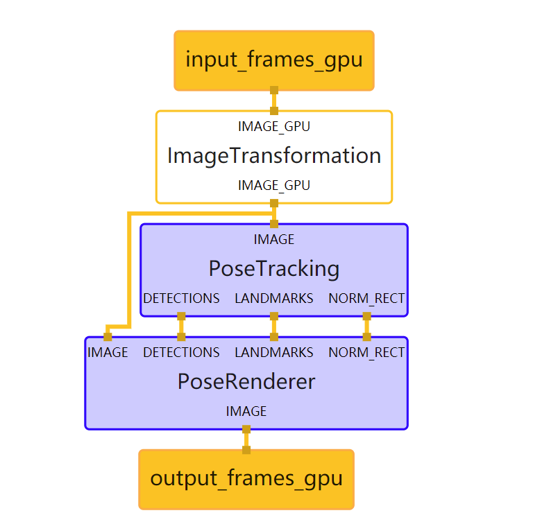
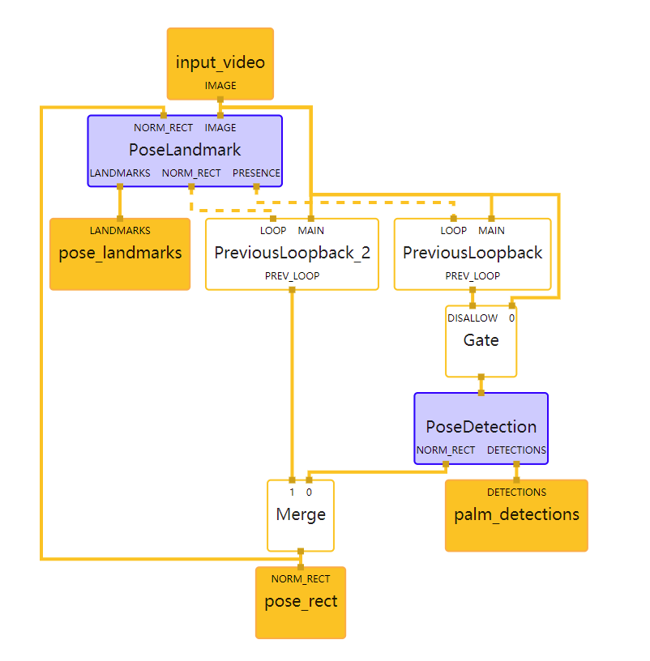
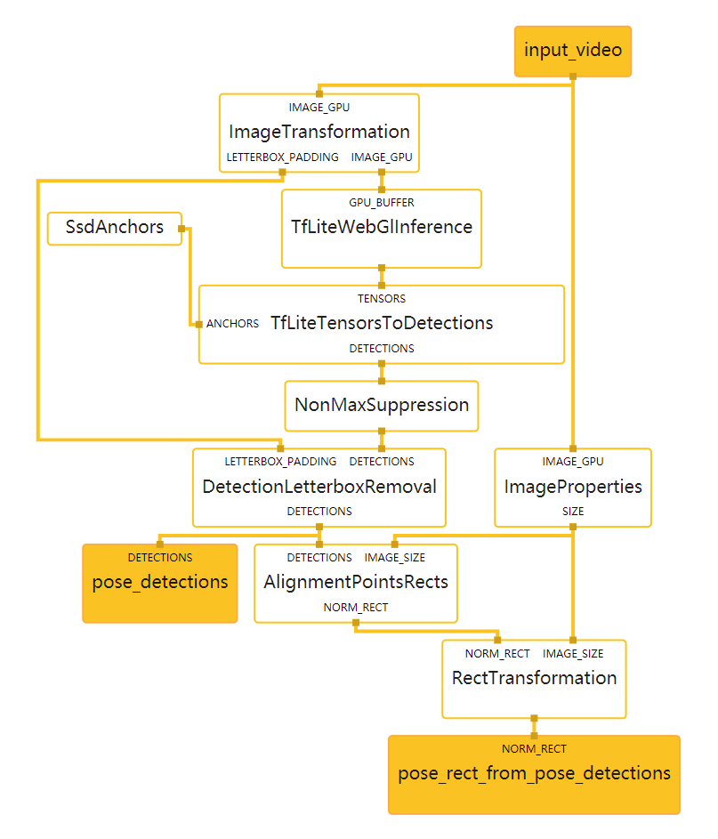
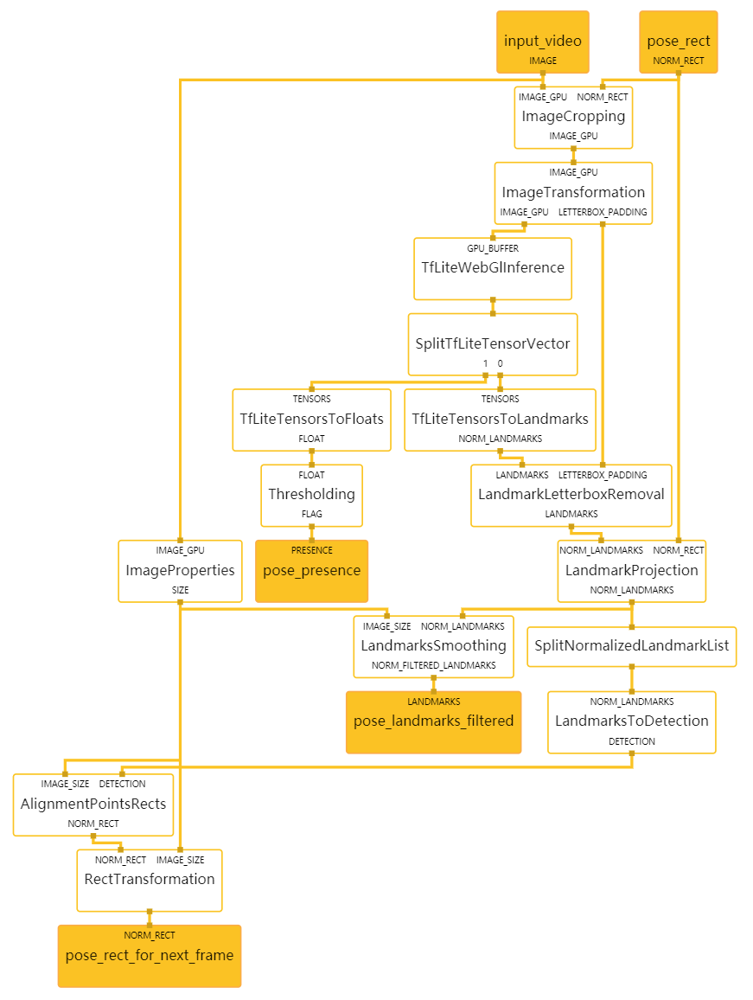
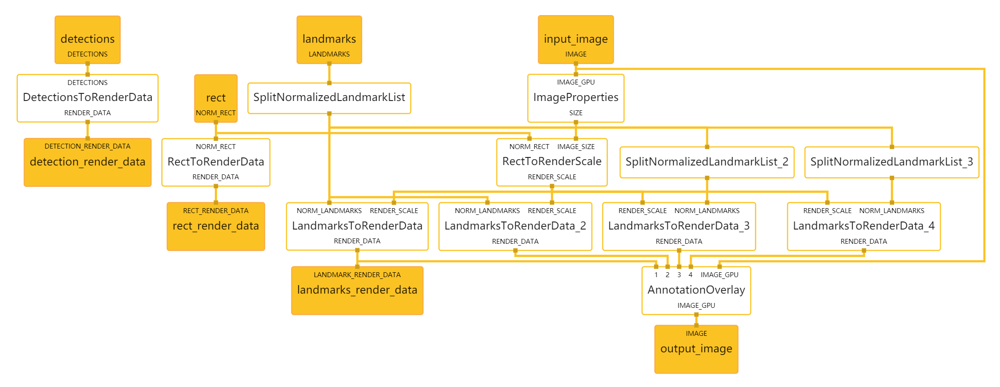
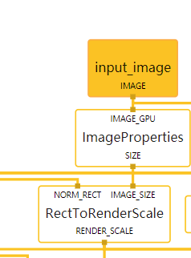

# Mediapipe Pose

[TOC]


## Pose_web



- image ---> graph

```json
# Images coming into and out of the graph.
input_stream: "input_frames_gpu"
output_stream: "output_frames_gpu"

max_queue_size: 100

executor: {
  name: ""
  type: "ApplicationThreadExecutor"
}
```

- ImageTransformation

对于自拍模式测试，我们在这里水平翻转(flip)。

```json
# For selfie-mode testing, we flip horizontally here.
node: {
  calculator: "ImageTransformationCalculator"
  input_stream: "IMAGE_GPU:input_frames_gpu"
  output_stream: "IMAGE_GPU:input_frames_gpu_flipped"
  node_options: {
    [type.googleapis.com/mediapipe.ImageTransformationCalculatorOptions]: {
      flip_horizontally: true
    }
  }
}
```

- PoseTrackkingSubgraph

```json
node {
  calculator: "PoseTrackingSubgraph"
  input_stream: "IMAGE:input_frames_gpu_flipped"
  output_stream: "LANDMARKS:pose_landmarks"
  output_stream: "NORM_RECT:pose_rect"
  output_stream: "DETECTIONS:pose_detections"
}
```

- PoseRendererSubgraph

```json
node {
  calculator: "PoseRendererSubgraph"
  input_stream: "IMAGE:input_frames_gpu_flipped"
  input_stream: "LANDMARKS:pose_landmarks"
  input_stream: "NORM_RECT:pose_rect"
  input_stream: "DETECTIONS:pose_detections"
  output_stream: "IMAGE:output_frames_gpu"
}
```


## PoseTrackingSubgraph



### function

```json
type: "PoseTrackingSubgraph"

input_stream: "IMAGE:input_video"
output_stream: "LANDMARKS:pose_landmarks"
output_stream: "NORM_RECT:pose_rect"
output_stream: "DETECTIONS:palm_detections"
```


### PreviousLoopback

缓存从 PoseLandmarkSubgraph 反馈的姿势存在(pose-presence)决策，并在下一个输入图像到达时发送缓存的决策，其中时间戳替换为输入图像的时间戳，本质上生成一个包含前一个姿势存在( pose-presence)决策的数据包(packet)。请注意，在第一个输入图像到达时，会发出一个空包以启动反馈循环。

```json
# Caches a pose-presence decision fed back from PoseLandmarkSubgraph, and upon
# the arrival of the next input image sends out the cached decision with the
# timestamp replaced by that of the input image, essentially generating a packet
# that carries the previous pose-presence decision. Note that upon the arrival
# of the very first input image, an empty packet is sent out to jump start the
# feedback loop.
node {
  calculator: "PreviousLoopbackCalculator"
  input_stream: "MAIN:input_video"
  input_stream: "LOOP:pose_presence"
  input_stream_info: {
    tag_index: "LOOP"
    back_edge: true
  }
  output_stream: "PREV_LOOP:prev_pose_presence"
}
```


### Gate

如果 PoseLandmarkSubgraph 能够识别前一张图像中的姿势存在，则丢弃传入图像。否则，通过传入图像以触发 PoseDetectionSubgraph 中的新一轮姿势检测。

```json
# Drops the incoming image if PoseLandmarkSubgraph was able to identify pose
# presence in the previous image. Otherwise, passes the incoming image through
# to trigger a new round of pose detection in PoseDetectionSubgraph.
node {
  calculator: "GateCalculator"
  input_stream: "input_video"
  input_stream: "DISALLOW:prev_pose_presence"
  output_stream: "pose_detection_input_video"

  node_options: {
    [type.googleapis.com/mediapipe.GateCalculatorOptions] {
      empty_packets_as_allow: true
    }
  }
}
```


### PoseDetectionSubgraph

检测姿势的子图

```json
# Subgraph that detections poses (see pose_detection_gpu.pbtxt).
node {
  calculator: "PoseDetectionSubgraph"
  input_stream: "pose_detection_input_video"
  output_stream: "DETECTIONS:palm_detections"
  output_stream: "NORM_RECT:pose_rect_from_palm_detections"
}
```


### PoseLandmarkSubgraph

定位姿势地标的子图

```json
# Subgraph that localizes pose landmarks (see pose_landmark_gpu.pbtxt).
node {
  calculator: "PoseLandmarkSubgraph"
  input_stream: "IMAGE:input_video"
  input_stream: "NORM_RECT:pose_rect"
  output_stream: "LANDMARKS:pose_landmarks"
  output_stream: "NORM_RECT:pose_rect_from_landmarks"
  output_stream: "PRESENCE:pose_presence"
}
```


### PreviousLoopback_2

缓存从 PoseLandmarkSubgraph 反馈的姿势矩形(pose rectangle)，并在下一个输入图像到达时发送缓存的矩形，其时间戳替换为输入图像的时间戳，本质上生成一个包含前一个姿势矩形的数据包(packet)。请注意，在第一个输入图像到达时，会发出一个空包以启动反馈循环。

```json
# Caches a pose rectangle fed back from PoseLandmarkSubgraph, and upon the
# arrival of the next input image sends out the cached rectangle with the
# timestamp replaced by that of the input image, essentially generating a packet
# that carries the previous pose rectangle. Note that upon the arrival of the
# very first input image, an empty packet is sent out to jump start the
# feedback loop.
node {
  calculator: "PreviousLoopbackCalculator"
  input_stream: "MAIN:input_video"
  input_stream: "LOOP:pose_rect_from_landmarks"
  input_stream_info: {
    tag_index: "LOOP"
    back_edge: true
  }
  output_stream: "PREV_LOOP:prev_pose_rect_from_landmarks"
}
```


### Merge

通过在两个流之一之间进行选择，将 PoseDetectionSubgraph 生成的姿势矩形流和 PoseLandmarkSubgraph 生成的姿势矩形流合并到单个输出流中。如果传入数据包不为空，则选择前者，即 PoseDetectionSubgraph 对当前图像执行姿势检测（因为 PoseLandmarkSubgraph 无法识别前一张图像中的姿势存在）。否则，选择后者，它永远不会为空，因为 PoseLandmarkSubgraphs 处理所有图像（通过 FlowLimiterCaculator）。

```json
# Merges a stream of pose rectangles generated by PoseDetectionSubgraph and that
# generated by PoseLandmarkSubgraph into a single output stream by selecting
# between one of the two streams. The former is selected if the incoming packet
# is not empty, i.e., pose detection is performed on the current image by
# PoseDetectionSubgraph (because PoseLandmarkSubgraph could not identify pose
# presence in the previous image). Otherwise, the latter is selected, which is
# never empty because PoseLandmarkSubgraphs processes all images (that went
# through FlowLimiterCaculator).
node {
  calculator: "MergeCalculator"
  input_stream: "pose_rect_from_palm_detections"
  input_stream: "prev_pose_rect_from_landmarks"
  output_stream: "pose_rect"
}
```


### PoseDetectionSubgraph




#### function

```json
# MediaPipe pose detection subgraph.

type: "PoseDetectionSubgraph"

input_stream: "input_video"
output_stream: "DETECTIONS:pose_detections"
output_stream: "NORM_RECT:pose_rect_from_pose_detections"
```


#### ImageTransformation

将 GPU 上的输入图像转换为 $128\times128$ 的图像。要缩放输入图像，将 `scale_mode` 选项设置为 `FIT` 以保留纵横比，从而导致转换后的图像中可能出现黑框。

```json
# Transforms the input image on GPU to a 128x128 image. To scale the input
# image, the scale_mode option is set to FIT to preserve the aspect ratio,
# resulting in potential letterboxing in the transformed image.
node: {
  calculator: "ImageTransformationCalculator"
  input_stream: "IMAGE_GPU:input_video"
  output_stream: "IMAGE_GPU:transformed_input_video"
  output_stream: "LETTERBOX_PADDING:letterbox_padding"
  node_options: {
    [type.googleapis.com/mediapipe.ImageTransformationCalculatorOptions] {
      output_width: 128
      output_height: 128
      scale_mode: FIT
    }
  }
}
```


#### TfLiteWebGlInference

[TFLite Model](https://www.tensorflow.org/lite/examples?hl=zh-cn)

在 GPU 上运行 TensorFlow Lite 模型，该模型获取图像张量(image tensor)并输出张量向量(vector of tensors)，例如检测框(boxes)/关键点(keypoints)和分数(scores)。

```json
# Runs a TensorFlow Lite model on GPU that takes an image tensor and outputs a
# vector of tensors representing, for instance, detection boxes/keypoints and
# scores.
node {
  calculator: "TfLiteWebGlInferenceCalculator"
  input_stream: "GPU_BUFFER:transformed_input_video"
  output_stream: "detection_tensors"
  node_options: {
    [type.googleapis.com/mediapipe.TfLiteInferenceCalculatorOptions] {
      model_path: "blazepose_detector_full_4kp_2020_07_13.tflite"
    }
  }
}
```


#### SsdAnchors

根据选项中的规范生成包含 **SSD 锚点向量**的单边数据包。

[SSD:Single Shot MultiBox Detector ](https://arxiv.org/abs/1512.02325)

[SSD CSDN](https://blog.csdn.net/c20081052/article/details/80391627?ops_request_misc=%257B%2522request%255Fid%2522%253A%2522162969465616780265498822%2522%252C%2522scm%2522%253A%252220140713.130102334..%2522%257D&request_id=162969465616780265498822&biz_id=0&utm_medium=distribute.pc_search_result.none-task-blog-2~all~sobaiduend~default-1-80391627.pc_search_all_es&utm_term=SSD%E9%94%9A%E7%82%B9&spm=1018.2226.3001.4187)

```json
# Generates a single side packet containing a vector of SSD anchors based on
# the specification in the options.
node {
  calculator: "SsdAnchorsCalculator"
  output_side_packet: "anchors"
  node_options: {
    [type.googleapis.com/mediapipe.SsdAnchorsCalculatorOptions] {
      num_layers: 4               # 层数
      min_scale: 0.1484375        # 最小比例
      max_scale: 0.75             # 最大比例
      input_size_height: 128      # 输入图像高度
      input_size_width: 128       # 输入图像宽度
      anchor_offset_x: 0.5        
      anchor_offset_y: 0.5
      strides: 8                  # 步长
      strides: 16
      strides: 16
      strides: 16
      aspect_ratios: 1.0          # 纵横比
      fixed_anchor_size: true     # 固定锚尺寸
    }
  }
}
```


#### TfLiteTensorsToDetections

根据 SSD 锚点和选项中的规范，将 TensorFlow Lite 模型生成的检测张量( detection tensors)解码为检测向量(vector of detections)。每个检测描述一个检测到的对象。

```json
# Decodes the detection tensors generated by the TensorFlow Lite model, based on
# the SSD anchors and the specification in the options, into a vector of
# detections. Each detection describes a detected object.
node {
  calculator: "TfLiteTensorsToDetectionsCalculator"
  input_stream: "TENSORS:detection_tensors"
  input_side_packet: "ANCHORS:anchors"
  output_stream: "DETECTIONS:detections"
  node_options: {
    [type.googleapis.com/mediapipe.TfLiteTensorsToDetectionsCalculatorOptions] {
      num_classes: 1
      num_boxes: 896
      num_coords: 12
      box_coord_offset: 0
      keypoint_coord_offset: 4
      num_keypoints: 4
      num_values_per_keypoint: 2
      sigmoid_score: true
      score_clipping_thresh: 100.0
      reverse_output_order: true
      x_scale: 128.0
      y_scale: 128.0
      h_scale: 128.0
      w_scale: 128.0
      min_score_thresh: 0.5
    }
  }
}
```


#### NonMaxSuppression

[NMS paper](https://arxiv.org/pdf/1704.04503.pdf)

[NMS 博客园参考](https://www.cnblogs.com/makefile/p/nms.html)

[NMS CSDN](https://blog.csdn.net/m0_37605642/article/details/98358864?utm_medium=distribute.pc_relevant_t0.none-task-blog-2%7Edefault%7EBlogCommendFromMachineLearnPai2%7Edefault-1.base&depth_1-utm_source=distribute.pc_relevant_t0.none-task-blog-2%7Edefault%7EBlogCommendFromMachineLearnPai2%7Edefault-1.base)

执行非最大抑制以消除过多的检测。

```json
# Performs non-max suppression to remove excessive detections.
node {
  calculator: "NonMaxSuppressionCalculator"
  input_stream: "detections"
  output_stream: "filtered_detections"
  node_options: {
    [type.googleapis.com/mediapipe.NonMaxSuppressionCalculatorOptions] {
      min_suppression_threshold: 0.3          # 最小抑制阈值
      overlap_type: INTERSECTION_OVER_UNION   # 重叠类型
      algorithm: WEIGHTED                     # 算法
      return_empty_detections: true           # 返回空检测
    }
  }
}
```


#### DetectionLetterboxRemoval

**检测信箱移除**：将信箱图像(letterboxed image)（使用 FIT 缩放模式进行图像转换后）上的检测位置（已归一化为 `[0.f, 1.f]`）调整到去除信箱的同一图像上的相应位置（图形的输入图像）图像变换前）。

```json
# Adjusts detection locations (already normalized to [0.f, 1.f]) on the
# letterboxed image (after image transformation with the FIT scale mode) to the
# corresponding locations on the same image with the letterbox removed (the
# input image to the graph before image transformation).
node {
  calculator: "DetectionLetterboxRemovalCalculator"
  input_stream: "DETECTIONS:filtered_detections"
  input_stream: "LETTERBOX_PADDING:letterbox_padding"
  output_stream: "DETECTIONS:pose_detections"
}
```


#### ImageProperties

**图像属性**: 从输入图像中提取图像大小。

```json
# Extracts image size from the input images.
node {
  calculator: "ImagePropertiesCalculator"
  input_stream: "IMAGE_GPU:input_video"
  output_stream: "SIZE:image_size"
}
```


#### AlignmentPointsRects

**对齐点矩形**: 根据中心和比例对齐点将姿势检测转换为矩形。姿势检测包含四个关键点：前两个用于全身姿势，另外两个用于上身姿势。

```json
# Converts pose detection into a rectangle based on center and scale alignment
# points. Pose detection contains four key points: first two for full-body pose
# and two more for upper-body pose.
node {
  calculator: "AlignmentPointsRectsCalculator"
  input_stream: "DETECTIONS:pose_detections"
  input_stream: "IMAGE_SIZE:image_size"
  output_stream: "NORM_RECT:pose_rect"
  node_options: {
    [type.googleapis.com/mediapipe.DetectionsToRectsCalculatorOptions] {
      rotation_vector_start_keypoint_index: 2     # 旋转向量起始关键点索引
      rotation_vector_end_keypoint_index: 3
      rotation_vector_target_angle_degrees: 90    # 旋转矢量目标角度度
      output_zero_rect_for_empty_detections: true # 空检测输出零矩形
    }
  }
}
```


#### RectTransformation

**矩形变换** : 使用训练期间使用的边距扩展姿势矩形。

```json
# Expands pose rect with marging used during training.
node {
  calculator: "RectTransformationCalculator"
  input_stream: "NORM_RECT:pose_rect"
  input_stream: "IMAGE_SIZE:image_size"
  output_stream: "pose_rect_from_pose_detections"
  node_options: {
    [type.googleapis.com/mediapipe.RectTransformationCalculatorOptions] {
      scale_x: 1.5
      scale_y: 1.5
      square_long: true
    }
  }
}
```


### PoseLandmarkSubgraph




#### function

```json
# MediaPipe pose landmark localization subgraph.

type: "PoseLandmarkSubgraph"

input_stream: "IMAGE:input_video"
input_stream: "NORM_RECT:pose_rect"
output_stream: "LANDMARKS:pose_landmarks_filtered"
output_stream: "NORM_RECT:pose_rect_for_next_frame"
output_stream: "PRESENCE:pose_presence"
```


#### ImageCropping

**图像裁剪** : 从输入图像中裁剪包含姿势的矩形。

```json
# Crops the rectangle that contains a pose from the input image.
node {
  calculator: "ImageCroppingCalculator"
  input_stream: "IMAGE_GPU:input_video"
  input_stream: "NORM_RECT:pose_rect"
  output_stream: "IMAGE_GPU:pose_image"
  node_options: {
    [type.googleapis.com/mediapipe.ImageCroppingCalculatorOptions] {
      border_mode: BORDER_REPLICATE
      output_max_width: 256
      output_max_height: 256
    }
  }
}
```


#### ImageTransformation

**图像转换** : 将 GPU 上的输入图像转换为 $256\times256$ 图像。要缩放输入图像，将 `scale_mode` 选项设置为 `FIT` 以保留纵横比，从而导致转换后的图像中可能出现黑框

```json
# Transforms the input image on GPU to a 256x256 image. To scale the input
# image, the scale_mode option is set to FIT to preserve the aspect ratio,
# resulting in potential letterboxing in the transformed image.
node: {
  calculator: "ImageTransformationCalculator"
  input_stream: "IMAGE_GPU:pose_image"
  output_stream: "IMAGE_GPU:transformed_input_video"
  output_stream: "LETTERBOX_PADDING:letterbox_padding"
  node_options: {
    [type.googleapis.com/mediapipe.ImageTransformationCalculatorOptions] {
      output_width: 256
      output_height: 256
      scale_mode: FIT
    }
  }
}
```


#### TfLiteWebGlInference

在 GPU 上运行 TensorFlow Lite 模型，该模型获取图像张量并输出张量向量，例如检测框/关键点和分数。

```json
# Runs a TensorFlow Lite model on GPU that takes an image tensor and outputs a
# vector of tensors representing, for instance, detection boxes/keypoints and
# scores.
node {
  calculator: "TfLiteWebGlInferenceCalculator"
  input_stream: "GPU_BUFFER:transformed_input_video"
  output_stream: "output_tensors"
  node_options: {
    [type.googleapis.com/mediapipe.TfLiteConverterCalculatorOptions] {
      zero_center: false
    }
    [type.googleapis.com/mediapipe.TfLiteInferenceCalculatorOptions] {
      model_path: "blazepose_upperbody_31kp_full_2020_08_06.tflite"
    }
  }
}
```


#### SplitTfLiteTensorVector

根据选项中指定的范围将 TFLite 张量向量拆分为多个向量。

```json
# Splits a vector of TFLite tensors to multiple vectors according to the ranges
# specified in option.
node {
  calculator: "SplitTfLiteTensorVectorCalculator"
  input_stream: "output_tensors"
  output_stream: "landmark_tensors"
  output_stream: "pose_flag_tensor"
  node_options: {
    [type.googleapis.com/mediapipe.SplitVectorCalculatorOptions] {
      ranges: { begin: 0 end: 1 }
      ranges: { begin: 1 end: 2 }
    }
  }
}
```


#### TfLiteTensorsToFloats

将姿势标志张量(pose-flag tensor)转换为表示姿势存在(pose presence)的置信度分数的浮点数。

```json
# Converts the pose-flag tensor into a float that represents the confidence
# score of pose presence.
node {
  calculator: "TfLiteTensorsToFloatsCalculator"
  input_stream: "TENSORS:pose_flag_tensor"
  output_stream: "FLOAT:pose_presence_score"
}
```


#### Thresholding

**阈值**: 将阈值应用于置信度分数以确定是否存在姿势。

```json
# Applies a threshold to the confidence score to determine whether a pose is
# present.
node {
  calculator: "ThresholdingCalculator"
  input_stream: "FLOAT:pose_presence_score"
  output_stream: "FLAG:pose_presence"
  node_options: {
    [type.googleapis.com/mediapipe.ThresholdingCalculatorOptions] {
      threshold: 0.5
    }
  }
}
```


#### TfLiteTensorsToLandmarks

将地标张量(landmark tensors)解码为地标向量(landmark vectors)，其中地标坐标通过输入图像的大小归一化为模型。

```json
# Decodes the landmark tensors into a vector of landmarks, where the landmark
# coordinates are normalized by the size of the input image to the model.
node {
  calculator: "TfLiteTensorsToLandmarksCalculator"
  input_stream: "TENSORS:landmark_tensors"
  output_stream: "NORM_LANDMARKS:landmarks"
  node_options: {
    [type.googleapis.com/mediapipe.TfLiteTensorsToLandmarksCalculatorOptions] {
      num_landmarks: 31
      input_image_width: 256
      input_image_height: 256
    }
  }
}
```


#### LandmarkLetterboxRemoval

**地标信箱移除** : 将信箱姿态图像（使用 FIT 缩放模式进行图像转换后）上的地标（已归一化为 `[0.f, 1.f]`）调整到去除信箱的同一图像上的相应位置（图像转换前的姿态图像） .

```json
# Adjusts landmarks (already normalized to [0.f, 1.f]) on the letterboxed pose
# image (after image transformation with the FIT scale mode) to the
# corresponding locations on the same image with the letterbox removed (pose
# image before image transformation).
node {
  calculator: "LandmarkLetterboxRemovalCalculator"
  input_stream: "LANDMARKS:landmarks"
  input_stream: "LETTERBOX_PADDING:letterbox_padding"
  output_stream: "LANDMARKS:scaled_landmarks"
}
```


#### LandmarkProjection

**地标投影** : 在裁剪之前将裁剪后的姿势图像中的地标投影到完整图像上的相应位置（输入到图形中）。

```json
# Projects the landmarks from the cropped pose image to the corresponding
# locations on the full image before cropping (input to the graph).
node {
  calculator: "LandmarkProjectionCalculator"
  input_stream: "NORM_LANDMARKS:scaled_landmarks"
  input_stream: "NORM_RECT:pose_rect"
  output_stream: "NORM_LANDMARKS:pose_landmarks"
}
```


#### ImageProperties

**图像属性**：从输入图像中提取图像大小。

```json
# Extracts image size from the input images.
node {
  calculator: "ImagePropertiesCalculator"
  input_stream: "IMAGE_GPU:input_video"
  output_stream: "SIZE:image_size"
}
```


#### LandmarksSmoothing

**地标平滑**： 平滑构成具有时间过滤的地标。

```json
# Smooths pose landmarks with temporal filtering.
node {
  calculator: "LandmarksSmoothingCalculator"
  input_stream: "NORM_LANDMARKS:pose_landmarks"
  input_stream: "IMAGE_SIZE:image_size"
  output_stream: "NORM_FILTERED_LANDMARKS:pose_landmarks_filtered"
  node_options: {
    [type.googleapis.com/mediapipe.LandmarksSmoothingCalculatorOptions] {
      velocity_filter: {
        window_size: 5
        velocity_scale: 10.0
      }
    }
  }
}
```


#### SplitNormalizedLandmarkList

拆分规范化地标列表

```json
node {
  calculator: "SplitNormalizedLandmarkListCalculator"
  input_stream: "pose_landmarks"
  output_stream: "alignment_landmarks"
  node_options: {
    [type.googleapis.com/mediapipe.SplitVectorCalculatorOptions] {
      ranges: { begin: 25 end: 27 }
    }
  }
}
```


#### LandmarksToDetection

**检测的地标**： 将姿势地标(pose landmarks)转换为紧密包围所有地标的检测(detection)。

```json
# Converts pose landmarks to a detection that tightly encloses all landmarks.
node {
  calculator: "LandmarksToDetectionCalculator"
  input_stream: "NORM_LANDMARKS:alignment_landmarks"
  output_stream: "DETECTION:pose_detection"
}
```


#### AlignmentPointsRects

**对齐点矩形**: 根据中心和比例对齐点将姿势检测转换为矩形。

```json
# Converts pose detection into a rectangle based on center and scale alignment
# points.
node {
  calculator: "AlignmentPointsRectsCalculator"
  input_stream: "DETECTION:pose_detection"
  input_stream: "IMAGE_SIZE:image_size"
  output_stream: "NORM_RECT:pose_rect_from_landmarks"
  node_options: {
    [type.googleapis.com/mediapipe.DetectionsToRectsCalculatorOptions] {
      rotation_vector_start_keypoint_index: 0
      rotation_vector_end_keypoint_index: 1
      rotation_vector_target_angle_degrees: 90
      output_zero_rect_for_empty_detections: true
    }
  }
}
```


#### RectTransformation

**矩形变换**: 使用训练期间使用的边距扩展姿势矩形。

```json
# Expands pose rect with marging used during training.
node {
  calculator: "RectTransformationCalculator"
  input_stream: "NORM_RECT:pose_rect_from_landmarks"
  input_stream: "IMAGE_SIZE:image_size"
  output_stream: "pose_rect_for_next_frame"
  node_options: {
    [type.googleapis.com/mediapipe.RectTransformationCalculatorOptions] {
      scale_x: 1.5
      scale_y: 1.5
      square_long: true
    }
  }
}
```


## PoseRendererSubgraph



### function

```json
# MediaPipe pose tracking rendering subgraph.

type: "PoseRendererSubgraph"

input_stream: "IMAGE:input_image"
input_stream: "DETECTIONS:detections"
input_stream: "LANDMARKS:landmarks"
input_stream: "NORM_RECT:rect"
output_stream: "DETECTION_RENDER_DATA:detection_render_data"
output_stream: "LANDMARK_RENDER_DATA:landmarks_render_data"
output_stream: "RECT_RENDER_DATA:rect_render_data"
output_stream: "IMAGE:output_image"
```


### Calculate scale for rendered objects

计算渲染对象的比例



```json
# --------------------------------------------------------------------------- #
# ------------------ Calculate scale for rendered objects ------------------- #
# --------------------------------------------------------------------------- #

# Get image size. 获取图像大小
node {
  calculator: "ImagePropertiesCalculator"
  input_stream: "IMAGE_GPU:input_image"
  output_stream: "SIZE:image_size"
}

# Calculate rendering scale based on the pose bounding box.
# 根据姿势边界框计算渲染比例。
node {
  calculator: "RectToRenderScaleCalculator"
  input_stream: "NORM_RECT:rect"
  input_stream: "IMAGE_SIZE:image_size"
  output_stream: "RENDER_SCALE:render_scale"
  node_options: {
    [type.googleapis.com/mediapipe.RectToRenderScaleCalculatorOptions] {
      # This values is slightly bigger than for 33 points model as rectagle for
      # 17 points is smaller and we want to keep same size of rendered objects.
      # 这个值比 33 点模型稍大，因为 17 点的矩形更小，我们希望保持相同大小的渲染对象。
      multiplier: 0.0012
    }
  }
}
```


### Render pose

渲染姿势

```json
# --------------------------------------------------------------------------- #
# ------------------------------- Render pose ------------------------------- #
# --------------------------------------------------------------------------- #
```


#### SplitNormalizedLandmarkList

**拆分规范化地标列表**：只取可见点。

```json
# Take only visible points.
node {
  calculator: "SplitNormalizedLandmarkListCalculator"
  input_stream: "landmarks"
  output_stream: "landmarks_visible"
  node_options: {
    [type.googleapis.com/mediapipe.SplitVectorCalculatorOptions] {
      ranges: { begin: 0 end: 25 }
    }
  }
}
```


#### LandmarksToRenderData

**渲染数据的地标**：将姿势连接渲染为白线。

```json
# Render pose connections as white lines.
node {
  calculator: "LandmarksToRenderDataCalculator"
  input_stream: "NORM_LANDMARKS:landmarks_visible"
  input_stream: "RENDER_SCALE:render_scale"
  output_stream: "RENDER_DATA:landmarks_render_data"
  node_options: {
    [type.googleapis.com/mediapipe.LandmarksToRenderDataCalculatorOptions] {
      landmark_connections: 0
      landmark_connections: 1
      landmark_connections: 1
      landmark_connections: 2
      landmark_connections: 2
      landmark_connections: 3
      landmark_connections: 3
      landmark_connections: 7
      landmark_connections: 0
      landmark_connections: 4
      landmark_connections: 4
      landmark_connections: 5
      landmark_connections: 5
      landmark_connections: 6
      landmark_connections: 6
      landmark_connections: 8
      landmark_connections: 9
      landmark_connections: 10
      landmark_connections: 11
      landmark_connections: 12
      landmark_connections: 11
      landmark_connections: 13
      landmark_connections: 13
      landmark_connections: 15
      landmark_connections: 15
      landmark_connections: 17
      landmark_connections: 15
      landmark_connections: 19
      landmark_connections: 15
      landmark_connections: 21
      landmark_connections: 17
      landmark_connections: 19
      landmark_connections: 12
      landmark_connections: 14
      landmark_connections: 14
      landmark_connections: 16
      landmark_connections: 16
      landmark_connections: 18
      landmark_connections: 16
      landmark_connections: 20
      landmark_connections: 16
      landmark_connections: 22
      landmark_connections: 18
      landmark_connections: 20
      landmark_connections: 11
      landmark_connections: 23
      landmark_connections: 12
      landmark_connections: 24
      landmark_connections: 23
      landmark_connections: 24

      landmark_color { r: 255 g: 255 b: 255 }
      connection_color { r: 255 g: 255 b: 255 }
      thickness: 3.0
      visualize_landmark_depth: false
      utilize_visibility: true
      visibility_threshold: 0.5
    }
  }
}
```


#### SplitNormalizedLandmarkList_2

采取左侧姿势地标

```json
# Take left pose landmarks.
node {
  calculator: "SplitNormalizedLandmarkListCalculator"
  input_stream: "landmarks_visible"
  output_stream: "landmarks_left_side"
  node_options: {
    [type.googleapis.com/mediapipe.SplitVectorCalculatorOptions] {
      ranges: { begin: 1 end: 4 }
      ranges: { begin: 7 end: 8 }
      ranges: { begin: 9 end: 10 }
      ranges: { begin: 11 end: 12 }
      ranges: { begin: 13 end: 14 }
      ranges: { begin: 15 end: 16 }
      ranges: { begin: 17 end: 18 }
      ranges: { begin: 19 end: 20 }
      ranges: { begin: 21 end: 22 }
      ranges: { begin: 23 end: 24 }

      combine_outputs: true
    }
  }
}
```


#### SplitNormalizedLandmarkList_3

采取右侧姿势地标

```json
# Take right pose landmarks.
node {
  calculator: "SplitNormalizedLandmarkListCalculator"
  input_stream: "landmarks_visible"
  output_stream: "landmarks_right_side"
  node_options: {
    [type.googleapis.com/mediapipe.SplitVectorCalculatorOptions] {
      ranges: { begin: 4 end: 7 }
      ranges: { begin: 8 end: 9 }
      ranges: { begin: 10 end: 11 }
      ranges: { begin: 12 end: 13 }
      ranges: { begin: 14 end: 15 }
      ranges: { begin: 16 end: 17 }
      ranges: { begin: 18 end: 19 }
      ranges: { begin: 20 end: 21 }
      ranges: { begin: 22 end: 23 }
      ranges: { begin: 24 end: 25 }

      combine_outputs: true
    }
  }
}
```


#### LandmarksToRenderData_2

将姿势关节渲染为白色的大圆圈。

```json
# Render pose joints as big white circles.
node {
  calculator: "LandmarksToRenderDataCalculator"
  input_stream: "NORM_LANDMARKS:landmarks_visible"
  input_stream: "RENDER_SCALE:render_scale"
  output_stream: "RENDER_DATA:landmarks_background_joints_render_data"
  node_options: {
    [type.googleapis.com/mediapipe.LandmarksToRenderDataCalculatorOptions] {
      landmark_color { r: 255 g: 255 b: 255 }
      connection_color { r: 255 g: 255 b: 255 }
      thickness: 5.0
      visualize_landmark_depth: false
      utilize_visibility: true
      visibility_threshold: 0.5
    }
  }
}
```


#### LandmarksToRenderData_3

将左侧关节渲染为橙色圆圈（在白色圆圈内）。

```json
# Render pose left side joints as orange circles (inside white ones).
node {
  calculator: "LandmarksToRenderDataCalculator"
  input_stream: "NORM_LANDMARKS:landmarks_left_side"
  input_stream: "RENDER_SCALE:render_scale"
  output_stream: "RENDER_DATA:landmarks_left_joints_render_data"
  node_options: {
    [type.googleapis.com/mediapipe.LandmarksToRenderDataCalculatorOptions] {
      landmark_color { r: 255 g: 138 b: 0 }
      connection_color { r: 255 g: 138 b: 0 }
      thickness: 3.0
      visualize_landmark_depth: false
      utilize_visibility: true
      visibility_threshold: 0.5
    }
  }
}
```


#### LandmarksToRenderData_4

将姿势右侧关节渲染为青色圆圈（在白色圆圈内）。

```json
# Render pose right side joints as cyan circles (inside white ones).
node {
  calculator: "LandmarksToRenderDataCalculator"
  input_stream: "NORM_LANDMARKS:landmarks_right_side"
  input_stream: "RENDER_SCALE:render_scale"
  output_stream: "RENDER_DATA:landmarks_right_joints_render_data"
  node_options: {
    [type.googleapis.com/mediapipe.LandmarksToRenderDataCalculatorOptions] {
      landmark_color { r: 0 g: 217 b: 231 }
      connection_color { r: 0 g: 217 b: 231 }
      thickness: 3.0
      visualize_landmark_depth: false
      utilize_visibility: true
      visibility_threshold: 0.5
    }
  }
}
```


### Render pose debug objects

渲染姿势调试对象

```json
# --------------------------------------------------------------------------- #
# ------------------------ Render pose debug objects ------------------------ #
# --------------------------------------------------------------------------- #
```


#### DetectionsToRenderData

渲染姿势检测矩形。

```json
# Render pose detection rect.
node {
  calculator: "DetectionsToRenderDataCalculator"
  input_stream: "DETECTIONS:detections"
  output_stream: "RENDER_DATA:detection_render_data"
  node_options: {
    [type.googleapis.com/mediapipe.DetectionsToRenderDataCalculatorOptions] {
      thickness: 4.0
      color { r: 0 g: 255 b: 0 }
    }
  }
}
```


#### RectToRenderData

渲染姿势地标矩形。

```json
# Render pose landmarks rect.
node {
  calculator: "RectToRenderDataCalculator"
  input_stream: "NORM_RECT:rect"
  output_stream: "RENDER_DATA:rect_render_data"
  node_options: {
    [type.googleapis.com/mediapipe.RectToRenderDataCalculatorOptions] {
      filled: false
      color { r: 255 g: 0 b: 0 }
      thickness: 4.0
    }
  }
}
```


#### AnnotationOverlay

**注释叠加**：绘制注释并将它们叠加在输入图像的顶部。

```json
# Draws annotations and overlays them on top of the input images.
node {
  calculator: "AnnotationOverlayCalculator"
  input_stream: "IMAGE_GPU:input_image"

  input_stream: "landmarks_render_data"
  input_stream: "landmarks_background_joints_render_data"
  input_stream: "landmarks_left_joints_render_data"
  input_stream: "landmarks_right_joints_render_data"
  # input_stream: "detection_render_data"
  # input_stream: "rect_render_data"

  output_stream: "IMAGE_GPU:output_image"
}
```

